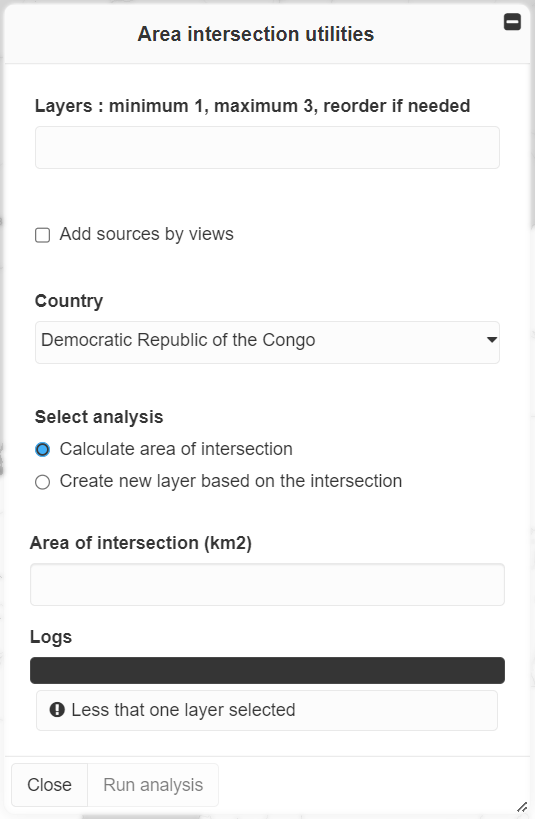

Area intersection tools
=======================

The **Area intersection tools** enables publishers to perform GIS-like
overlap analysis to:

1. calculate the exact area of overlapping features;
2. create a new data source from the result of the analysis.

How do I use the Area intersection tool?
----------------------------------------

Publishers can access the tool from the **Toolbox** by clicking on the
**Area intersection tools** button. Analyses are done at the project
level, which means that only data sources published in the current
project can be used. In addition, to optimize the use of computing
resources, analyses are limited to the extent of a single country.

   Area intersection tools interface

To perform an analysis, you must:

1. Select 1 to 3 data sources. The **Add sources by views** helper
   allows to add data sources from the views activated in the map and/or
   from the title of the views published in the project.

   .. figure:: ./img/area-int-panel-inputs.png
      :width: 400
      :align: center
      :class: with-shadow

      Selection of data sources

2. Select a country: the analysis is limited to the extent of a single
   country (administrative boundaries are from `GAUL
   2015 <https://data.apps.fao.org/map/catalog/srv/eng/catalog.search?id=12691#/metadata/9c35ba10-5649-41c8-bdfc-eb78e9e65654>`__).

3. Select the type of analysis (both types can be performed one after
   the other):

   1. **Calculate area of intersection**: click on **Run analysis** once
      the sources have been selected. The overlap area in km2 is
      displayed in the MapX interface.

      .. figure:: ./img/area-int-panel-area-result.png
         :width: 400
         :align: center
         :class: with-shadow

         Area of intersection

   2. **Create new layer based on the intersection**: Before clicking on
      **Run analysis**, you must define the name of the data source that
      will be published in the current project. Once the analysis
      completed, you will receive an email informing you that the source
      is available in the database and you will be able to use it to
      create new views in the projet.

      .. figure:: ./img/area-int-panel-area-new-source.png
         :width: 400
         :align: center
         :class: with-shadow

         Creation of a new layer based on the intersection

.. note::
   The **Area intersection tools** are only available to publishers due to
   the high resource-load needed to process the data in the back-end. For
   the same reason, the number of layers that can be used for analysis is
   limited to 3, plus the administrative boundary of a country.
