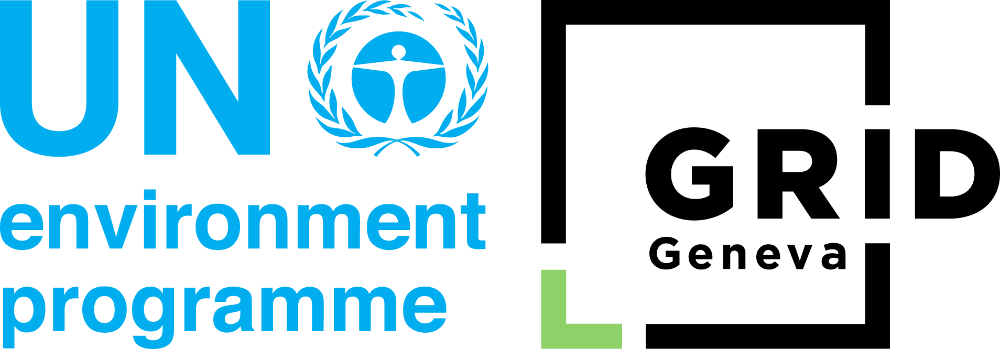

Terms of use
============

**Last Updated: 28 January 2025**

MapX is a platform developed and maintained by GRID-Geneva
("we," "our," or "us") to support  environmental decision-making
by transforming data into actionable information.

By accessing and using MapX, you agree to comply with these 
**Terms of use**. If you do not agree to these terms, please discontinue 
your use of MapX.

General information
-------------------

MapX is a product of GRID-Geneva, a partnership between the United Nations
Environment Programme (UNEP), the Swiss Federal Office for the Environment
(FOEN), and the University of Geneva (UniGe). The platform is operated from
Switzerland and adheres to applicable international and local laws, including
those set by the United Nations.

User responsibilities
---------------------

Acceptable use
^^^^^^^^^^^^^^

Users agree to:

- Use MapX solely for lawful purposes and in accordance with these 
  **Terms of use**.
- Refrain from uploading, sharing, or transmitting any content that 
  is defamatory, obscene, illegal, or infringes on intellectual 
  property rights.
- Avoid actions that could damage, disable, overburden, or impair MapX 
  or interfere with another user's experience.

Intellectual property
---------------------

MapX ownership
^^^^^^^^^^^^^^

All intellectual property rights for the MapX platform, including its design,
functionality, and content, belong to GRID-Geneva and its licensors unless
explicitly stated otherwise.

Data ownership and access
^^^^^^^^^^^^^^^^^^^^^^^^^

Data uploaded to a workspace in MapX is owned by the user who uploaded it.
However, by default, all publishers and administrators within the same workspace
have the ability to use, edit and share this data. This collaborative model
ensures seamless interaction and updates within the workspace. For users who
wish to retain exclusive control over their data, MapX provides options in
the interface to restrict access and editing rights. Users are encouraged
to configure these settings as needed to align with their preferences and
data-sharing requirements.

Users who publish their data publicly on MapX agree that all MapX users can
view, reuse, create new content from, and export their public data, subject to
the permissions of the applicable license. By making data publicly accessible,
users consent to its broader use within the MapX ecosystem while retaining
ownership of the original dataset.

Licensing of data
^^^^^^^^^^^^^^^^^

Data available on MapX may be subject to a variety of licensing terms, covering
both public and private datasets. Most datasets on MapX are open source and
provided under licenses such as Creative Commons or other open data licenses.
However, some datasets may have restricted access or proprietary licenses.
Users are required to comply with the specific licensing terms associated with
each dataset. Licensing details, including access restrictions and usage
permissions, are clearly stated in the metadata for each dataset.
Users are encouraged to review and adhere to these terms before using the data.

United Nations Geospatial Data
^^^^^^^^^^^^^^^^^^^^^^^^^^^^^^

The international and administrative boundaries, along with the first
subnational level and country names displayed in the MapX base map,
are sourced from the United Nations Geospatial Data (scale: 1:1 million,
version: 2020). These layers have been styled in accordance with
the "Guidance for the Publication of Maps" issued by the United Nations
in November 2020.

The designations employed and the presentation of material do not imply
the expression of any opinion whatsoever on the part of the Secretariat of
the United Nations and GRID-Geneva concerning the legal status of any country,
territory, city or area or of its authorities, or concerning the delimitation
of its frontiers or boundaries.

- Final status of Jammu and Kashmir has not yet been agreed upon by the parties.
  A dotted line represents approximately the Line of Control in Jammu and
  Kashmir agreed upon by India and Pakistan.
- Final boundary between the Republic of Sudan and the Republic of 
  South Sudan has not yet been determined.
- Final status of the Abyei area is not yet determined.
- A dispute exists between the Governments of Argentina and the 
  United Kingdom of Great Britain and Northern Ireland concerning 
  sovereignty over the Falkland Islands (Malvinas).

Disclaimer and limitation of liability
--------------------------------------

The content of MapX is provided by a range of data suppliers and does not
necessarily reflect the views or policies of GRID-Geneva. Materials on MapX
are offered "as is", and GRID-Geneva makes no warranties or representations
regarding their accuracy, completeness, or reliability. MapX may also contain
links to third-party websites, and GRID-Geneva is not responsible for, nor
does it necessarily endorse, any content on these external sites.

To the fullest extent permitted by law, GRID-Geneva is not liable for
any direct, indirect, incidental, or consequential damages arising from
your use of MapX. This includes damages resulting from reliance on user-uploaded
content or external links, for which GRID-Geneva does not assume
any responsibility or liability.

Platform availability
---------------------

MapX is provided "as is", and while we strive to ensure uninterrupted 
access and accuracy of content, we do not guarantee error-free 
operation or the completeness of information.

Privacy policy
--------------

MapX is committed to protecting user data in accordance with its 
**Privacy policy**, including compliancy to the General Data Protection
Regulation (GDPR). Please review our :doc:`Privacy policy <privacy-policy>`
for detailed information on data collection, usage, and user rights.

Modifications to the terms
---------------------------

GRID-Geneva reserves the right to update or modify these **Terms of use** at
any time. Changes will be communicated via the MapX platform or email.
Continued use of MapX following any updates constitutes  acceptance of
the revised terms.

Termination of access
---------------------

GRID-Geneva may suspend or terminate user access to MapX at its  discretion,
without notice, for violations of these **Terms of use** or other policies.
Upon termination, any content uploaded by the user may  be anonymized
to maintain platform functionality.

Governing law and dispute resolution
------------------------------------

These **Terms of use** are governed by Swiss law and the legal frameworks 
of the United Nations. Disputes arising from these terms will be subject
to arbitration under international arbitration rules or  resolved through
Swiss courts in Geneva, as appropriate.

Contact information
-------------------

For questions or concerns about these **Terms of use**, please contact us:

|image1|

**Physical address**

| GRID-Geneva
| International Environment House
| 11, Chemin des Anémones
| 1219 Châtelaine
| Switzerland
| 1st Floor A Block

**Postal mail**

| UN Environment Programme / GRID-Geneva
| Avenue de la Paix 8-14
| 1211 Geneva 10
| Switzerland

| Website: `https://unepgrid.ch <https://unepgrid.ch/en>`__
| Email: `info@mapx.org <mailto:info@mapx.org>`__

By using MapX, you acknowledge that you have read, understood, and 
agree to these **Terms of use**.

