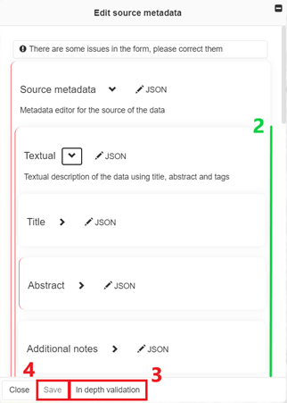

Editing the metadata of a source
================================

1. To fill in or edit the metadata of a source, click on the **Toolbox**
   tab and then on **Edit sources metadata**:

2. A window appears and allows you to edit the metadata, of each source
   for which you have editing rights:

   1. select the desired source
   2. edit the metadata through the form
   
      .. warning::
         red lines indicate fields that need to be filled in or that
         contain invalid values

   3. verify that all recommended metadata elements are filled in
   4. save your edits by clicking on **Save**.

.. figure:: ./img/metadata-select-source.png
   :width: 400
   :align: center
   :class: with-shadow

