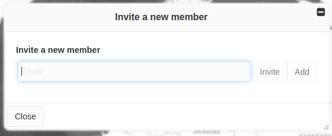
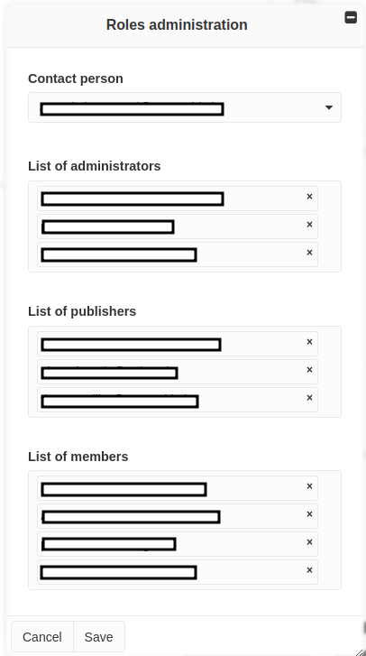

Management of members/roles
===========================

.. note::
   Within a project, each time a member is added or user roles are
   updated, all project administrators will receive an email notifying
   them of these changes.

Invite new members
------------------

Administrators can invite users to join their project from the **Invite
a new member** tool available in the **Toolbox**. To do so, the email
address of the person to add must be entered in the panel and one of the
following option should be selected:

1. **Invite**: A formal invitation is sent to the person by email. The
   invitation must be accepted within two days by clicking on the link
   provided in the email.
2. **Add**: The person is directly added to the project as a member.
   They are notified by email about their new membership.
   
   .. note::
      For this option to be available, the email address provided must
      be that of a user who is already registered in MapX.

Setting users roles and permissions
-----------------------------------

Administrators can define the roles of each project member from the
**Define Roles** tool. Please note that users must first be added as
members before being able to upgrade their role. The different types of
roles available in MapX are described :ref:`here <roles>`.

Only administrators can define the roles of other members, publishers,
and administrators. If more administrators exist, each of them oversees
the management of the project and has equal full power. An administrator
must be designated as **Contact person** to receive membership requests
that are sent by public users - if the service has been enabled in the
project configuration.

Receiving/accepting membership requests from public users
---------------------------------------------------------

Requests from public users wanting to become members of a project are
sent by email to the project **Contact person** (see above). These
emails, sent from bot@mapx.org, contain all the necessary information
for the **Contact person** to accept or refuse the requests. To accept,
the administrator simply has to click within two days on the link
provided in the request. An invitation will be sent back to the user
that requested the membership.
