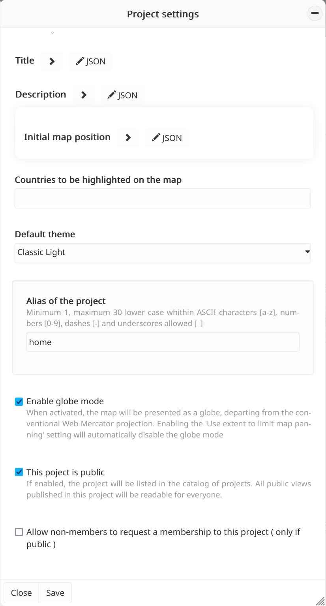

Project configuration
=====================

Administrators can access the **Project configuration** tool from the
**Toolbox** and fill/update the following settings:

-  **Title** (multilingual)
-  **Description** (multilingual): brief summary of the project content
-  **Initial map position**: default map position when the project is
   loaded by a user. In addition, it is possible to limit the map
   panning to the defined position, thus limiting what users will be
   able to see when exploring the project (e.g., a project can be
   limited to the Mediterranean region and only display its extent).
-  **Countries to be highlighted on the map**
-  **Default theme**: default MapX theme when the project is loaded by a
   user
-  **Alias of the project**: a human readable name with which the
   project is identified and that can be used in the URL for accessing
   the project
-  **Enable globe mode**: administrators have the option to default to
   the globe mode to display data in the map instead of the Web Mercator
   projection.
   
   .. warning::
      Enabling the **Use extent to limit map panning** setting
      (in the **Initial map position** section) will automatically
      disable the globe mode.

In addition to the settings above, there are two options for defining
the degree of openness of the project:

1. Public or private project: while public projects can be searched in
   the list of projects by all MapX users, private projects are only
   visible/accessible by their members.
   
   .. note::
      Don't forget that it is possible to define specific reading rights
      for each view of a project. It is therefore possible to publish
      private views (e.g., available only to members) in a public project.

2. Allow public users to apply for a member role in the project: this
   option complements the **Invite a new member** tool available to
   administrators (see below).
