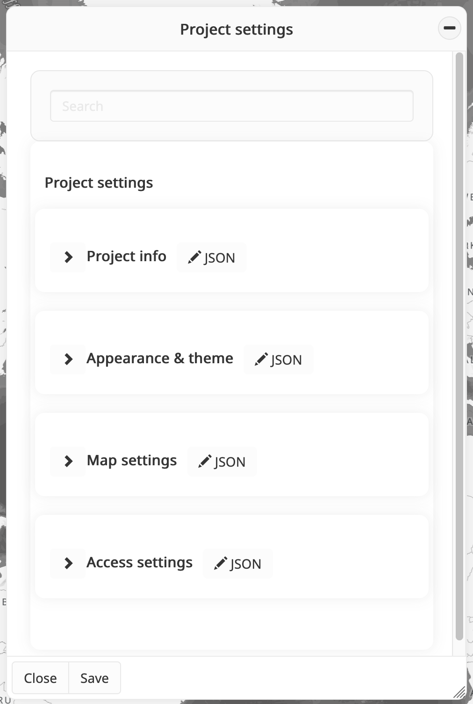

Project configuration
=====================

Administrators can access the **Project configuration** tool from the
**Toolbox** and fill/update the following settings:

Project info
------------

-  **Title** (multilingual)
-  **Description** (multilingual): brief summary of the project content.
-  **Alias of the project**: a human-readable name used to identify the project,
   which can also be included in the URL to access it directly.
-  **Organisation details**

   - **Name**: the name of the organisation managing the project.
   - **Contact name**: primary contact person for the project.
   - **Contact email**: email address for inquiries related to the project.

-  **Terms of use**: project-specific terms that complement the :doc:`general
   MapX terms <../legal-notices/terms-of-use>`, defining rules and guidelines
   applicable to this particular project.

Appearance & theme
------------------

-  **Project logo**: the logo displayed in the MapX interface for the current
   project, helping to visually identify the project. The logo must be provided
   in ``SVG`` format.
-  **Default theme**: the theme automatically applied when a user opens
   the project. This can be a standard MapX theme or a custom theme defined by
   a project administrator.

Map settings
------------

-  **Countries to be highlighted on the map**: select which countries should
   be visually emphasized when the project is displayed.
-  **Initial map position**: defines the default map position when a user opens
   the project. Additionally, map panning can be restricted to this defined
   area, limiting the geographic extent that users can explore. For example,
   a project focused on the Mediterranean region can be configured to only
   display that area.

   .. warning::
      Enabling the **Use extent to limit map panning** option
      (in the **Initial map position** section) will automatically
      disable the globe mode.

-  **Map projection**: administrators can choose the default display mode for
   the map, either as a globe or using the Web Mercator projection. It is also
   possible to disable the globe mode button in the menu bar, preventing users
   from switching to the globe view.
-  **Default boundary type**: defines which administrative boundaries are
   displayed by default in the project map. Administrators can choose between
   United Nations official boundaries, WMO official boundaries, OpenStreetMap
   boundaries, or no administrative boundaries.

Access settings
---------------

In addition to the general project settings, MapX provides two options
to define the level of accessibility for a project:

1. Public or private project:
   
   -  Public projects are visible and searchable in the project list for
      all MapX users.
   -  Private projects are only accessible to members explicitly added to
      the project.
   
   .. note::
      It is possible to define specific read permissions for each project view.
      For example, a private view (accessible only to members) can exist within
      a public project.

2. Allow public users to request membership:

   -  Enabling this option allows users who are not currently members to apply
      for a member role in the project.
   -  This feature complements the **Invite a new member** tool available to
      project administrators.
