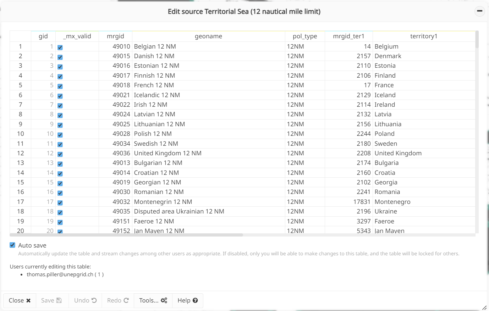
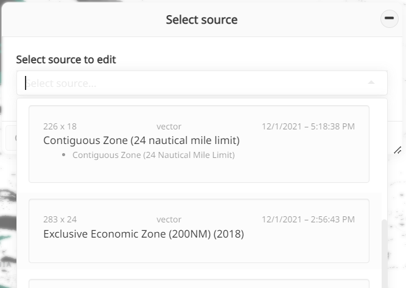
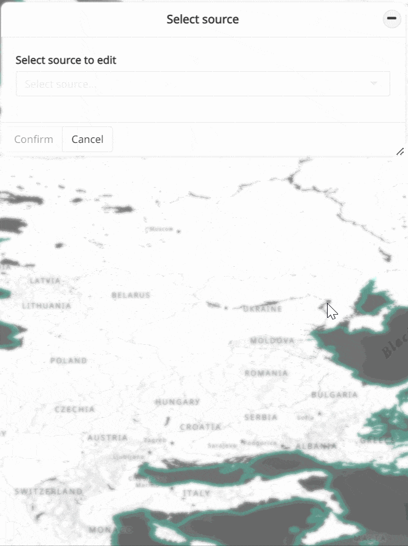
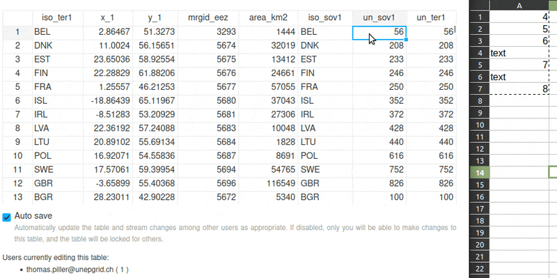
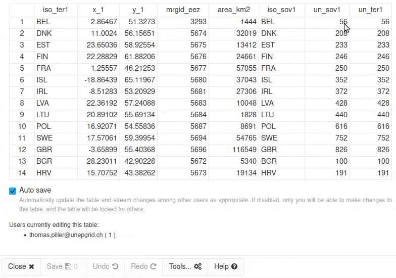
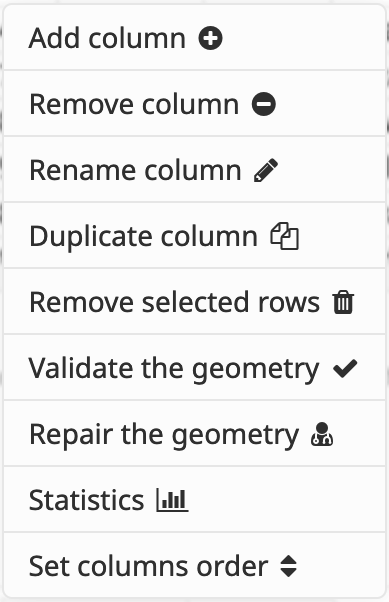
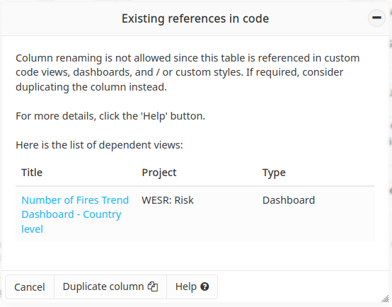
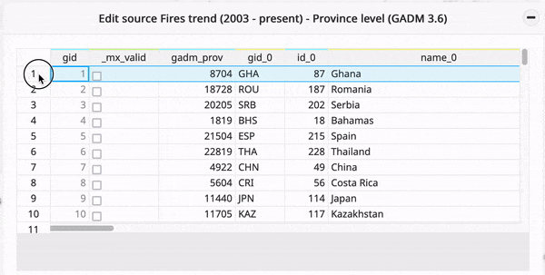
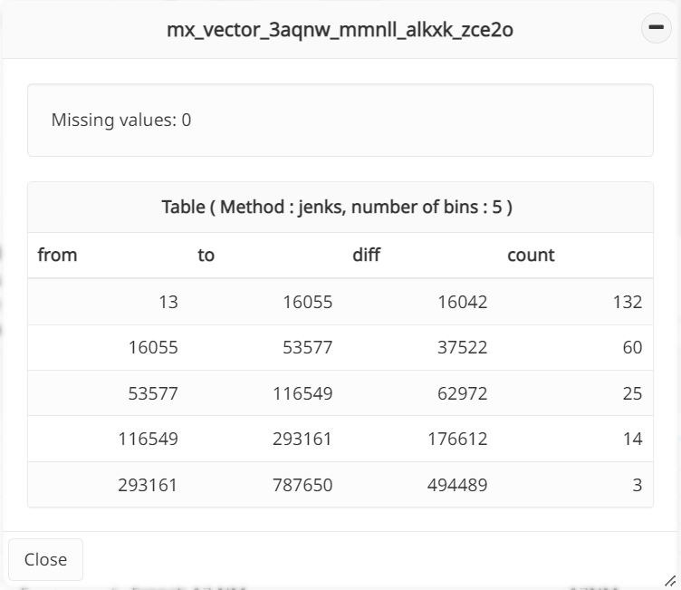
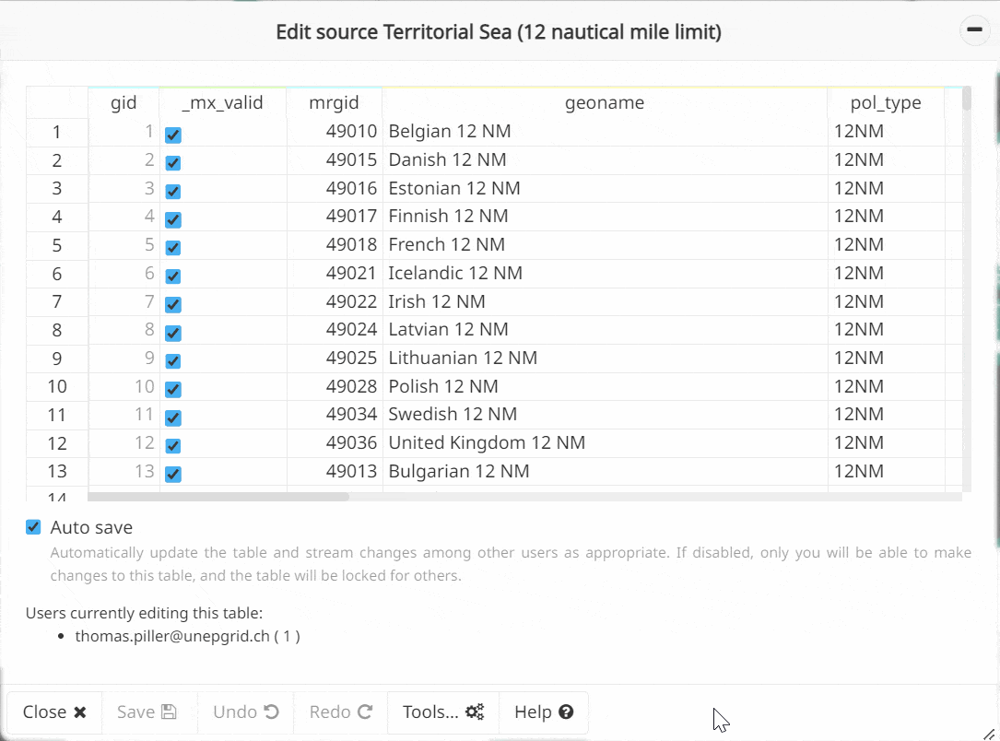

Edit vector source
==================

.. warning::
   The MapX database currently utilizes two separate backup systems. However,
   user-specific data recovery is not yet supported for structural changes to
   tables, such as deletions of rows or columns, which are considered
   irreversible. Therefore, using the **Edit vector source** tool may cause
   data to be permanently altered or even deleted, as with desktop spreadsheet
   editors. Please use this tool with caution.

The **Edit vector source** is an interactive workspace allowing to
access the tabular data of a vector source and edit its content
dynamically (i.e., update values, add/remove columns, validate/repair
geometries). It is available to publishers from the **Toolbox** or
directly from vector views (more details :ref:`here <edit-attribute-table>`).

Currently, only attributes can be edited. The **Edit vector source**
tool doesn't *yet* include drawing functions like reshape, merge, split,
or trim to modify geometry shapes manually, as you would find in GIS
software like `QGIS <https://www.qgis.org/en/site/>`__ or `ArcGIS
Pro <https://www.esri.com/en-us/arcgis/products/arcgis-pro/overview>`__).

This feature becomes particularly valuable when paired with the 
:doc:`Join Editor <table-join-tool>`, allowing you to seamlessly join
custom tables to existing geometries, such as country boundaries.

   Edit vector source tool layout

How does the tool work?
-----------------------

Selecting the source to edit
~~~~~~~~~~~~~~~~~~~~~~~~~~~~

   Selection of the source to edit

Once the tool is opened from the **Toolbox**, a drop-down list presents
all the sources editable by the current user. For each source, the
following information is provided:

-  title
-  last modification date
-  type of source
-  dimensions (rows x columns)
-  list of views based on source

A search can be performed on the list by entering text in the
interactive field. All the information listed above are parsed and
matching texts are underlined.

.. note::
   In order not to compromise the user experience and to avoid any
   performance problem, editing is limited to sources having less than
   10,000 rows and 1,000 columns. Beyond these dimensions, the source is
   grayed out in the list and cannot be selected.

Editing the content of the attribute table
~~~~~~~~~~~~~~~~~~~~~~~~~~~~~~~~~~~~~~~~~~

As several users can edit the same source in parallel, two editing modes
have been developed:

1. auto-save ``ON (default)``: all edits are
   automatically pushed to the database and dynamically transmitted to all
   users viewing/editing the same source. Parallel edits are allowed in
   this mode. This behavior is similar to what other spreadsheet
   applications offer (e.g., Google Sheets, Microsoft Excel online).
   
2. auto-save ``OFF``: table editing is blocked for everyone except the
   active user. Parallel edits are therefore not allowed in this mode.
   Changes are not automatically saved to the database. The **Save** button
   must be clicked to push all changes to the database and to all users
   viewing/editing the source. The number of modifications that have not
   been saved in the database is indicated in the **Save** button.

   .. figure:: ./img/edit-sources-locked.png
      :width: 600
      :align: center
      :class: with-shadow

      Blocked user when auto-save is deactivated

By default, auto-save is ``ON``. The MapX team advises users to use this
mode when editing sources.

In either mode, editing is straightforward. First, select the cell(s) to
edit and then enter or paste the new value(s). If invalid values are
entered during this operation (i.e., the data type does not match),
cell(s) will be highlighted in orange in the table. Invalid values are
obviously not saved to the database.

.. warning::
   Numeric values must be formatted with a ``.`` as a decimal separator.

As long as the **Edit vector source** tool has not been closed, it is
possible to undo/redo all the changes using the dedicated buttons
(located at the bottom of the panel).

Advanced tools
~~~~~~~~~~~~~~

Nine advanced tools are available from the dedicated button at the
bottom of the panel:

   Advanced tools

.. _add-column:

Add column
^^^^^^^^^^

This tool allows to add a new empty column to the source. Naming rules
are as follows: - cannot start with a number - spaces, special
characters and `reserved
keywords <https://www.postgresql.org/docs/current/sql-keywords-appendix.html>`__
are prohibited - length should be more than 3 and less than 50
characters - no duplicates

By default, news columns are added at the last position of the source
but it is possible to move them using the **Set columns order** tool
(see below).

.. note::
   New columns are not automatically added to secondary attributes of
   views. Therefore, the view settings need to be updated to use them in a
   dashboard or visualize them (i.e., attributes table, pop-up) (more
   details :ref:`here <configuring-view>`).

Remove column
^^^^^^^^^^^^^

This tool allows to remove a specific column from the source. The
deletion will be performed in the database and all interactive tables.
It is not possible to undo this action after the last confirmation panel.

.. note::
   It is not possible to delete a column that is used as a primary and/or
   secondary attribute in views.

.. tip::
   A publisher may not have editing rights on all the views using the
   column to be deleted. In such a case, the list of views using the source
   is available from the :doc:`Manage sources <managing-sources>` tool and
   the email address of the view's last editor is available in
   the view's metadata. If deletion is mandatory, please contact
   the publishers in question to request an update to these views or
   the MapX team at info@mapx.org.

Rename column
^^^^^^^^^^^^^

This tool allows to rename a column from the source (see
:ref:`Add column <add-column>` for naming rules).

In the event that some code uses data from the source, the tool is
blocked to avoid breaking publicly available content. Code may be:

- custom code views
- vector views with a custom style
- dashboards (which can be associated with any type of views)

In the tool interface, a table lists all views with code that depends on
the source. The views title is a clickable link allowing easy access to
publishers for editing.

   List of references in code

In such a scenario, to rename a column follow these steps:

1. duplicate the desired column (a shortcut is available at the bottom
   of the panel)

2. update the code for the views listed in the table using the new
   column/name defined in point 1

3. update the views settings so that only the new column is listed
   in the primary and/or secondary attributes

4. delete the original column now that it is no longer used anywhere

Duplicate column
^^^^^^^^^^^^^^^^

This tool allows to duplicate a column of the attribute table with its
content. As a new column is added, the same restrictions as **Add
column** apply (see above).

Remove selected rows
^^^^^^^^^^^^^^^^^^^^

This tool allows to delete rows from the dataset that have been previously
selected from the table editor. To select rows, simply click on the row indexes.
Multiple selection can be performed by holding down the ``CTRL`` key or
``Command`` key on macOS. The deletion will be performed in the database and
all interactive tables. It is not possible to undo this action after the last
confirmation panel.

   Selecting rows for deletion

.. note::
   While it's possible to delete all the rows of a source without impacting
   the MapX application, an empty source will definitely become unusable,
   as it is currently not possible to add new rows to sources.

Validate the geometry
^^^^^^^^^^^^^^^^^^^^^

This tool checks the
`validity <https://postgis.net/docs/using_postgis_dbmanagement.html#OGC_Validity>`__
of all the source geometries (`most important for polygons as lines and
points cannot be
invalid <https://postgis.net/workshops/postgis-intro/validity.html>`__)
without repairing them. Validity is evaluated with the **PostGIS**
function `ST_IsValid() <https://postgis.net/docs/ST_IsValid.html>`__ and
the result is saved in the ``_mx_valid`` column which is automatically
generated by MapX. Having a source with valid geometries
(``_mx_valid IS TRUE``) is crucial as it is a prerequisite for using
algorithms for geometry calculations (e.g.
:doc:`Area intersection tools <../advanced-tools/area-intersection-tools>`).

Repair the geometry
^^^^^^^^^^^^^^^^^^^

This tool repairs the invalid geometries present in the source. Polygons
(remember lines and points are always valid) with a ``FALSE`` value in
the ``_mx_valid`` column will be repaired using the **PostGIS**
`ST_Buffer() <https://postgis.net/docs/ST_Buffer.html>`__ function.
Buffer output is always a valid polygonal geometry and it can handle
invalid inputs, so buffering by distance 0 is used as a way of repairing
invalid polygons (`source <https://postgis.net/docs/ST_Buffer.html>`__).

.. warning::
   In rare cases, valid outputs may not conform to your intuition as to
   their appearance.

Statitics
^^^^^^^^^

This tool allows to get basic statitics for a given attribute as well as
the number of missing values it has. ``numeric`` type attributes are
automatically classified in 5 bins/classes using the Jenks method. A
frequency table of distinct values is displayed for ``boolean`` and
``string`` type attributes.

   Attribute statistics

Set columns order
^^^^^^^^^^^^^^^^^

This tool allows to define the order in which the columns are displayed
when the attribute table is viewed or edited. The use of this tool does
not alter the table in the database but just its rendering in MapX.

