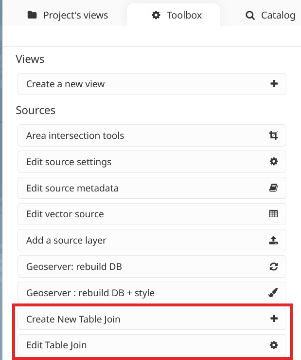
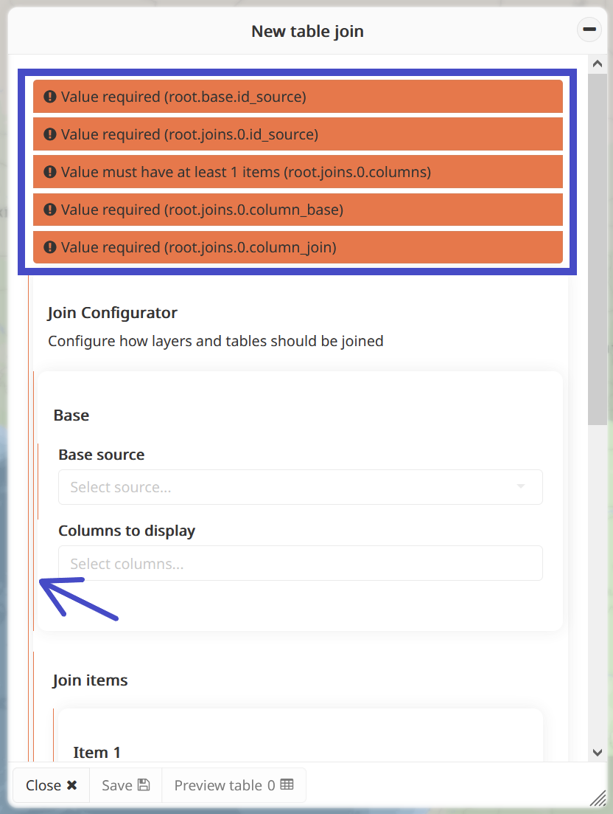

Table join tool
===============

The MapX join tool, developed in 2024, addresses a specific user
requirement: the ability to seamlessly integrate tabular statistical
data with map visuals using reference geometries such as UNMap, which
offers authoritative administrative boundaries recognized by the United
Nations. By leveraging joins within MapX, users can efficiently combine
datasets without duplicating information, thus optimizing database
storage space and maintenance. This approach ensures data integrity
while empowering users to enrich their geospatial datasets with
additional attributes from tabular sources.

SQL joins
---------

A SQL join is an operation that combines data from two or more tables in
a relational database based on a related column between them. This
operation allows to fetch data from multiple tables in a single query,
providing a unified view of the data.

Types of joins
~~~~~~~~~~~~~~

There are several types of joins in SQL, each with its specific use
cases. Four types have been implemented in the MapX join tool:

1. **Inner Join**: This is the most common type of join. It returns only
   the rows that have matching values in both tables. For example, if
   you join a table of customers with a table of orders, it will return
   only customers who have placed an order.

2. **Left Join (or Left Outer Join)**: This type of join returns all
   rows from the left table and the matching rows from the right table.
   If there is no match in the right table, it will return NULL for the
   columns from the right table.

3. **Right Join (or Right Outer Join)**: This is the opposite of a left
   join. It returns all rows from the right table and the matching rows
   from the left table. If there is no match in the left table, it will
   return NULL for the columns from the left table.

4. **Full Join (or Full Outer Join)**: This type of join returns all
   rows from both tables, matching rows where possible. If there is no
   match in either table, it will return NULL for the columns from the
   table that doesn't have a match.

.. figure:: ./img/table-join-schema.png
   :align: center
   :class: with-shadow

   Types of SQL joins (source: knoldus.com)

Why joins are useful
~~~~~~~~~~~~~~~~~~~~

-  **Combining data**: Joins allow you to combine data from different
   tables into a single result set, providing a more comprehensive view
   of your data.

-  **Flexibility**: By using different types of joins, you can control
   which data is included in the final result set, tailoring the output
   to your specific needs.

-  **Data integrity**: Joins enable you to maintain relationships
   between tables, which is important for ensuring data integrity and
   consistency.

-  **Avoiding data duplication**: By using joins with a set of reference
   tables for geometry (e.g., countries, regions, administrative units
   at level 1 and 2), you can avoid duplicating data in the database.
   This approach saves storage space and helps maintain data integrity
   by having a single source of truth for each geometry reference.

-  **Adding geometry columns**: In a cartographic application such as
   MapX, you may want to join a tabular dataset with a geospatial
   dataset to add a geometry column. This allows you to visualize
   tabular datasets in the map and/or to integrate additional attributes
   into your geospatial data, making it richer and more informative.

The table join tool in MapX
---------------------------

In MapX, users can now generate new vector data sources by performing
joins between two or more existing data sources, whether they are vector
or tabular. These join-type sources are stored within the MapX database
and function like any other vector source once published in your
project. The management of source settings, including access and editing
rights, downloading permissions, metadata, and the creation of vector
views based on join-type sources, follow identical procedures.

Create/edit a table join
~~~~~~~~~~~~~~~~~~~~~~~~

The following sections will guide you through the process of
creating/editing a join-type source, along with providing key insights
into their functionality.

Key concepts
^^^^^^^^^^^^

Here are some key concepts related to table join tools in MapX:

1. **Source base**: This serves as the foundational data source whose
   geometry column is utilized in the creation of the join-type source.
   The geometry column from the base source is seamlessly integrated
   into the join-type source.

2. **Join item(s)**: Tabular or vector sources whose attributes are
   joined to the base source. Multiple join items can be joined to the
   base source. Please note that the geometry column of the join items
   is not included in the process. Only one geometry column will be
   available in the join-type source, which comes from the base source.

3. **Validation**: Ensures that all necessary fields are filled out
   correctly and any errors or mandatory fields are addressed before
   proceeding.

4. **Permissions**: The tool is accessible only to publishers and
   utilizes vector or tabular sources from within the project,
   respecting their reading rights, along with global sources that are
   public across all MapX projects.

5. **Join-type sources**: These are sources created via the tool,
   essentially functioning as vector sources in MapX. They share similar
   characteristics such as configuration settings, metadata, and view
   creation. However, two essential points to note:

   1. Activation of downloading for a join-type source relies on
      enabling the download option for all sources involved in the join.

   2. Modifying the attribute table of a join-type source necessitates
      edits to the tabular/vector sources constituting the join. Any
      changes made to these sources will be automatically reflected in
      the join-type source.

Step-by-step instructions
^^^^^^^^^^^^^^^^^^^^^^^^^

The tools for creating/editing a join-type source can be found in the
MapX toolbox:

Since both tools share the same interface, only the creation process is
presented here. Editing follows the same procedure, adhering to the same
validity rules.

To create a join-type source, follow these steps:

1. Open the **Create New Table Join** tool from the toolbox.

2. Provide a name for the join-type source you wish to add to your
   project. Once you've entered the name, click on the **Create New
   Join** button to continue.

   .. figure:: ./img/table-join-creation.png
      :width: 300
      :align: center
      :class: with-shadow

   .. figure:: ./img/table-join-demo.gif
      :width: 400
      :align: center
      :class: with-shadow

3. Configure the **Base**:

   -  **Source base**: Select the vector source containing the geometry
      column for the join.
   -  **Columns to display**: Specify the columns from the base source
      to integrate into the join.

4. Configure one or more **Join item(s)**:

   -  **Join source**: Select the vector or tabular source to join with
      the base source.
   -  **Columns to display**: Specify the columns from the join item
      (source) to include in the join.
   -  **Base column**: Indicate the column from the source base used for
      joining.
   -  **Type**: Define the type of join to execute (refer to above for
      more information).
   -  **Join column**: Specify the column from the join source for
      joining purposes.

   .. note::
      The columns used to join sources are not automatically included in
      the join-type source. Be sure to add them to the columns to display
      if you want them included.

5. Once the join is configured, you can preview the table that will be
   published to the MapX database by clicking the **Preview table**
   button. If the join is valid, the **Save** button becomes active,
   completing the creation process.

6. Once the new join-type source is published in the MapX database, it
   will automatically appear in other MapX tools, and the data can be
   visualized through a vector-type view.

Validation system
^^^^^^^^^^^^^^^^^

Validation within the interface ensures that all necessary fields are
filled out correctly and that any errors or mandatory fields are
addressed before proceeding. Mandatory fields or errors are prominently
displayed at the top of the panel and along the left edge with thin red
lines. Until all warnings are resolved within the interface, saving the
configuration will not be possible.

