Creating a story map
====================

To prepare your story map, we recommend creating what is known as
a storyboard to plan your story map before developing it on the
platform. With each step you should know what the content will include:
a title, text, picture, video, and/or spatial data. Before embarking on
the implementation of your story map, make sure that all geospatial data
is available in MapX and that you have collected and prepared all
supporting media (i.e., photos, infographics, videos). An example of a
storyboard is available
`here <https://owncloud.unepgrid.ch/index.php/s/UQg31o7snXaYULF/download>`__
and its implementation in MapX
`here <https://app.mapx.org/static.html?language=en&views=MX-YF1T2-42JUK-5EXLM&zoomToViews=true&p=0&b=0&z=3.814&lat=19.573&lng=-86.892&t3d=false&sat=false&theme=water_light>`__.

Glossary
--------

Here are the specific terms you will find in the story map editing tool:

-  **Step**: the steps of your story map are what appears on the screen.
   These are equivalent to “chapters” of your story: when the first
   chapter is over, create another by adding a new step.
-  **Slide**: a slide is the box containing the text or images you see
   on your screen. You can show different slides one your screen,
   meaning you can add different slides to each step.
-  **Class**: the class is the parameter given to your slide. It
   determines the position of your slides on the screen, the level of
   transparency, etc.

Creating a story map view
-------------------------

Story maps are a special type of view in MapX. Their creation and
configuration is similar to that of vector views which is described in
detail in :doc:`Publication of new views <../views/publication-new-view>`.
Please refer to this chapter for full details.

Adding content to a story map
-----------------------------

Once you have created and configured your story map (view), you can
start designing/implementing its content.

To edit the content of your story map, click on the **Edit story map**
button in the view tools. This will open the main menu to edit the
story.

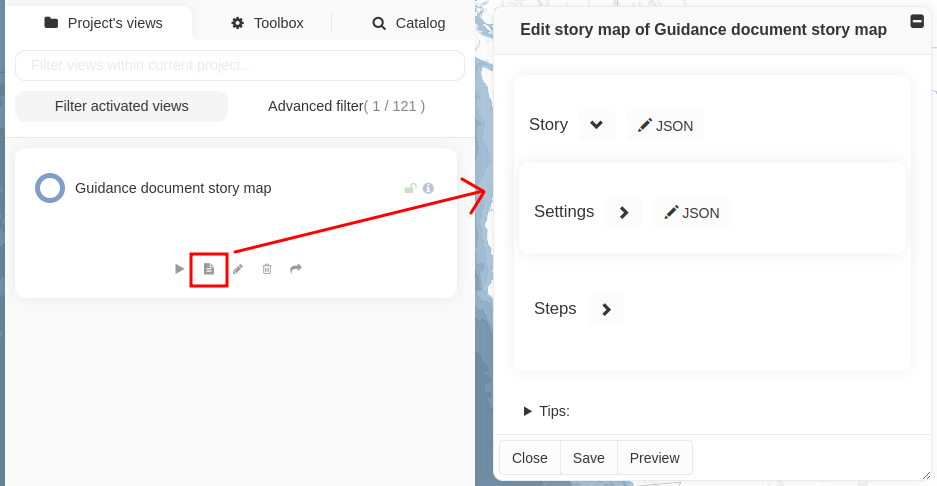

   Access to the story map editing tool

From here on, this guide will take you step by step through all of all
the tools at your disposal to design the content of the story map.

Defining the settings of a story map
~~~~~~~~~~~~~~~~~~~~~~~~~~~~~~~~~~~~

First, you should define the settings that will apply to the whole story
map by clicking on the arrow ``>`` to expend the **Settings** section:

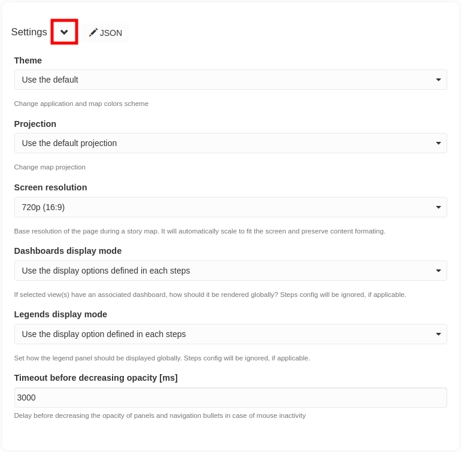

   Global story map settings

-  **Theme**: change application and map colors scheme (the default
   theme in MapX is **Classic light**)
-  **Projection**: change map projection (the default projection in MapX
   is **Web Mercator**)
-  **Screen resolution**: resolution of the page during reading. It will
   automatically scale to fit the screen and preserve content
   formatting. The default parameters of the screen resolution are
   automatically set on 720p (16:9). The most used screen resolution is
   720p and 1080p.
-  **Dashboards display mode**: if view(s) in the story map have an
   associated dashboard, this setting allows to define how they will be
   rendered (i.e., open, closed or hidden). This setting applies to the
   whole story map, but it can be overwritten at each step if necessary.
-  **Legends display mode**: set how the legend panel should be
   displayed in the story map (i.e., open or closed). This setting
   applies to the whole story map, but it can be overwritten at each
   step if necessary.
-  **Timeout before decreasing opacity [ms]**: delay before decreasing
   the opacity of panels (i.e., legends, dashboards, pop-ups) and the
   menu bar in case of mouse inactivity.

Creating a step
~~~~~~~~~~~~~~~

The step is the space containing your narrative, your pictures, etc.
that support the map. It is basically a chapter of your story map
(similar to the slide concept in PowerPoint). Typically, a story map has
between 15 and 20 steps. To create a complete story map, you will have
to repeat the operations described in the sections below for each of
them.

To create/add a new step, click on the ``+ Step`` button. Once the step
is created, you can expand its editing section by clicking on the ``>``
arrow.

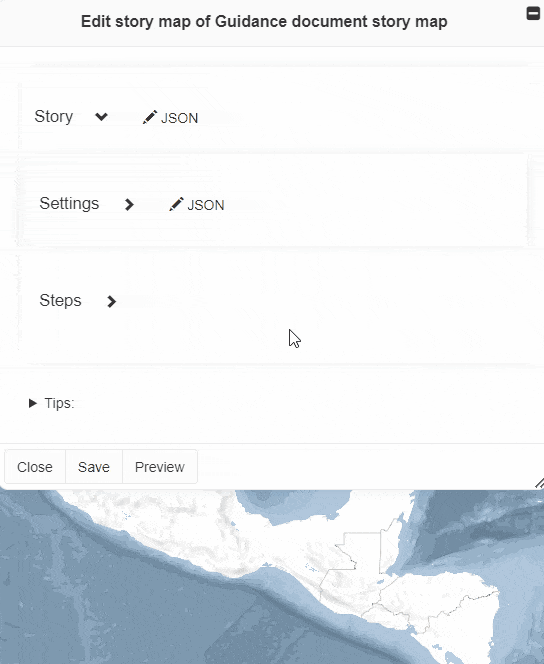

   Creating a step

Here is a brief overview of the different tools you will find in the
step editing section some of which are detailed in dedicated subsections
that you will find further down this page.

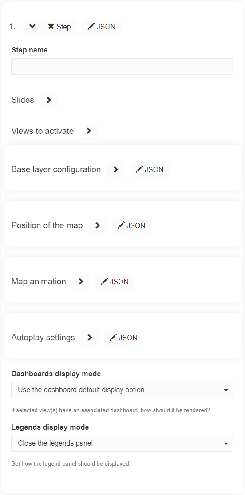

   Step editing section

-  **Step name**: set a title to the step to keep your story map
   organized. Titles can be edited at any time. As a story map typically
   has 15-20 steps, finding the step you want to edit becomes easier and
   will allow the reader to know where they are in your story. You can
   move your steps around by clicking the up and down arrows beneath
   each step title.
-  **Slides**: add a slide to the step. Slides are boxes where media
   (e.g., photo, video) and text elements can be added to the current
   step of the story map.
-  **Views to activate**: add data on the map.
-  **Base layer configuration**: add a high-resolution aerial imagery to
   the map and/or to enable the 3d terrain mode which make elevation
   appears in 3 dimensions. The 3d terrain mode renders well at high
   zoom, with the camera tilted.
-  **Position of the map**: set the position of the map for a given
   step. Either manually enter the center coordinates and zoom of the
   map or (recommended) use the **Update using current map parameter**
   to automatically set the map according to its current position. This
   determines what geographic area is displayed on the map.
-  **Map animation**: set the way of transitioning from one step to the
   next step of the story map.
-  **Autoplay settings**: define how the step will be played when the
   story map is consulted in autoplay mode (triggered by pressing the
   spacebar), in particular the time during which the step is displayed.
-  **Dashboards display mode** and **Legends display mode**: override
   the global options set in the story map settings.

.. note::
   - Remember to regularly save your draft story map by clicking on
     the **Save** button located at the bottom of the story map editor.
   - The **Preview** button lets you see what the story map will look like.
     This is especially useful when experimenting with different design
     solutions for the content you want to display.

Creating a slide
^^^^^^^^^^^^^^^^

By creating slides (the building blocks of a step), you add content into
the step of the story map. It is recommended to add one slide per
content (e.g., title, text, photo, video, etc.).

To add a new slide, expand the **Slide** section by clicking on ``>``
arrow and then click on the ``+ Slide`` button.

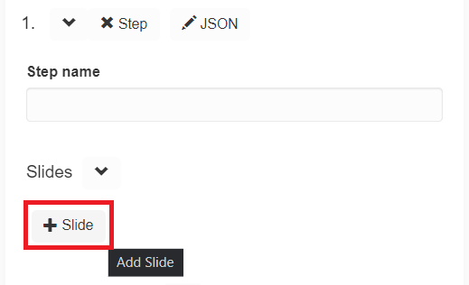

   Creating a slide

To stay organized, title your slide immediately after creating it (e.g.,
slide 1: photo; slide 2: text; etc.).

It is possible to add content to the slide in HTML format directly from
the **Content** section but we recommend that you do not do so. A more
interactive method for adding text, image or video is available and
described below. Before adding content interactively, we recommend that
you configure the step as follows:

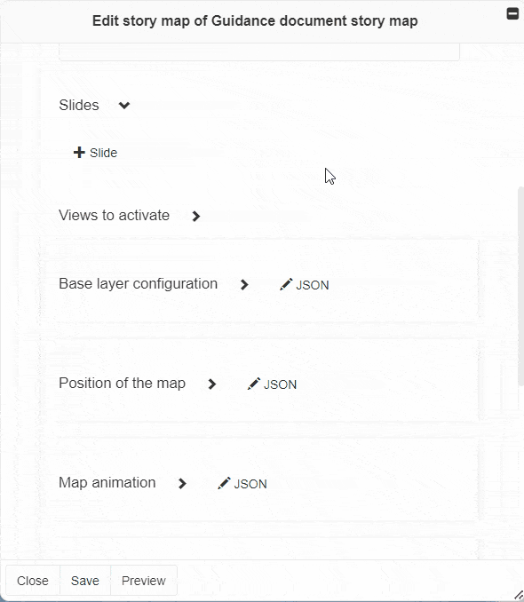

-  **Text color**: click on the color bar to choose the color to be
   applied to the text.
-  **Background color**: click on the color bar to choose the color to
   be applied to the background of the slide.
-  **Background opacity**: click on the number in the box and define
   manually the opacity between 0 and 1. **NB**: 0 is totally
   transparent and 1 is totally opaque.
-  **Base text size in pixels**: click on the text size number in the
   box and define manually the size of the text.
-  **Effects**: this section allows you to configure parallax effect(s)
   on the slide. This is an advanced option that is not widely used in
   MapX and therfore, not covered in detail in this document.
-  **Allow scrolling**: enable this option if the slide content goes
   outside the container. A scrollbar will be displayed automatically.
-  **Slide classes**: click on this section to define the positioning of
   your slide using the pre-configured classes. Classes can be combined
   (e.g., ``half-top / half-bottom`` + ``half-left / half-right`` to
   place the slide in the quadrant of your choice).

.. hint::
   - Photos look good when either placed in one of the quadrants or
     as a full-size image in the background.
   - Full screen titles look good with e.g., the ``half-horizontal-center``
     class for the text and a full-size image in the background.
   - Adding the ``image-cover`` class to the slide means that if you insert
     a photo, it will be displayed over the whole slide defined by
     the other classes. You can change the order of the image in the slide
     so that text is displayed on top using the arrows next to the slide number.
   - The ``text`` classes define the alignment of the text within the slide.

Once the slides are configured, press the **Preview** button to view
your step. To edit the content of the slides in interactive mode, press
the pencil button in the top-left corner. You can now click in a slide
and add content i.e., text, photos, videos. A panel containing text
formatting options and tools for adding images and videos is
automatically displayed in the interface as soon as this editing mode is
activated.

When done with editing, click on the green button located on the
top-left corner of the screen to save all changes or click on the red
button to discard them.

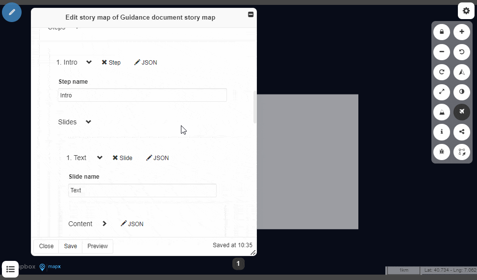

In case an image and/or a video is added in a slide, it can be resized
by dragging one of its corners and its positioning can be fine-tuned
using additional options by clicking on the “img” or “iframe” button
located in the bottom-left corner.

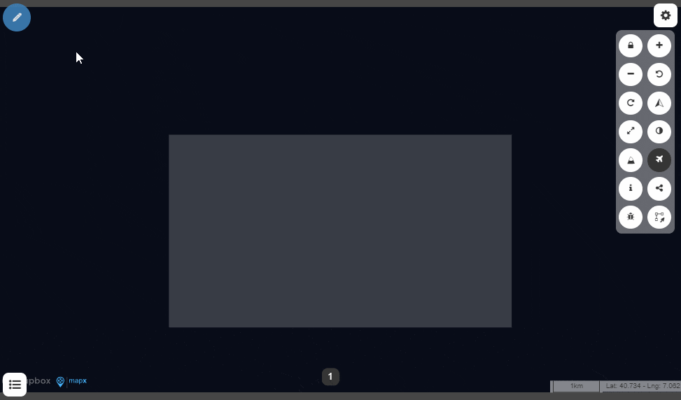

Adding a hyperlink
^^^^^^^^^^^^^^^^^^

You may need to add a hyperlink in your narrative to refer to further
information or to cite a data source. To do so, select the text to
attach the hyperlink to, and click on the “tie” icon. A text box appears
above the highlighted text, paste your link, and click on the green
(check) button to save it. If you want the link to open in a new tab
(which we recommend), you just have to click on the “external” (circled
in purple) button before saving your link.

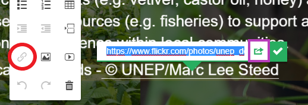

   Add a hyperlink

Activate views
^^^^^^^^^^^^^^

The **Activate views** section allows you to enable spatial data (views)
to be displayed in the map for a given step. All public views as well as
private views for which you have read rights (except for story maps, no
inception possible) can be activated in the map. Multiple views can be
activated in the same step and if so, they will be organized according
to the order defined in the tool (e.g., View 1 being the top layer and
the View 2 being the bottom layer).

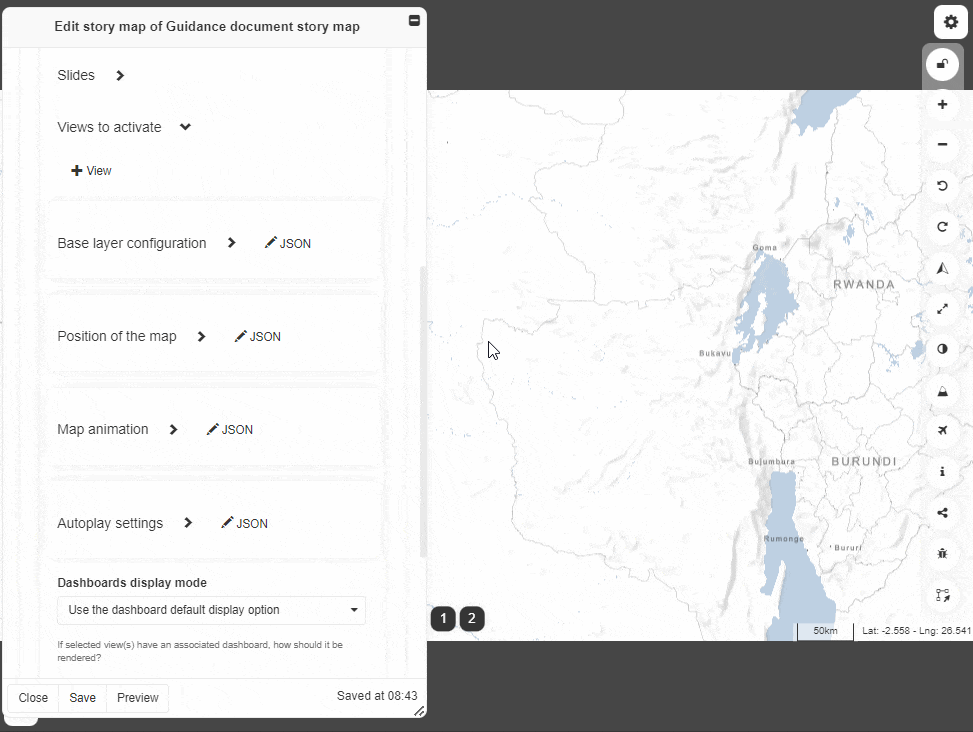

**Reminder**: if you want to display your data with the aerial mode as
basemap, you will have to activate it from the **Base layer
configuration** section.

Position of the map
^^^^^^^^^^^^^^^^^^^

By default, the steps cover the entire world which is suitable for the
visualization of global data but depending on the subject you are
addressing, it may be relevant to show a specific geographic area in the
map in your story map. To do so:

1. Expand the **Position of the map** section.
2. Click on the lock button in the menu bar (top-right corner) to unlock
   the map.
3. With your mouse, you can now zoom in, zoom out, and move the map
   as much as you want to select the area of your interest.
4. Click again on the lock button to lock the map.
5. Click on the **Update using current map parameters** to update
   the geographic coordinates of the map according to the map you see on
   your screen. The geographic coordinates of your map appear automatically
   in the text boxes.

.. figure:: ./img/sm-edit-step-map-position.gif
   :align: center
   :class: with-shadow

Map animation
^^^^^^^^^^^^^

The **Map animation** section lets you choose the transition from one
step to the next in a story map.

.. note::
   The settings provided in this section apply to how you get to the
   current step. In other words, to customize the transition from the first
   to the second step, you will need to edit the **Map animation** settings
   on Step 2.

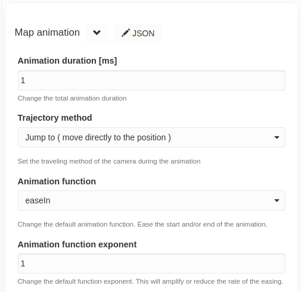

   Map animation section

-  **Animation duration**: the time over which the transition spans in
   millisecond [ms].
-  **Trajectory method**: this describes the kind of transition between
   the steps.
-  **Animation function** and **Animation function exponent**: these are
   additional settings you can experiment to personalize the map
   animation of your story map.
