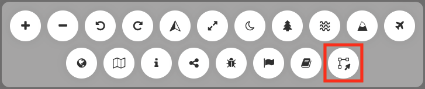
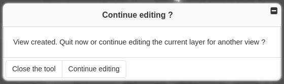
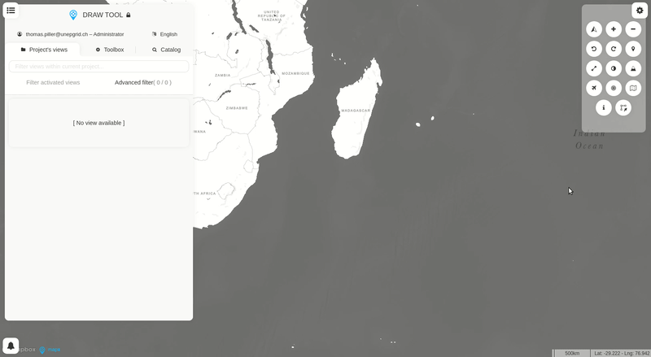

Draw tool
=========

The **Draw tool** enables users to create new datasets by drawing
features on the map, to download them once saved and to add them to the
current project if their privileges allow it (i.e., publisher, admin).

How to create a new vector layer from scratch in MapX?
------------------------------------------------------

Users regardless of their privileges can access the **Draw tool** from
the tool bar located in the top-right corner of the application.

   Location of the Draw tool in the menu bar

Once the tool is activated, users must first choose the type of
geometries that will compose their dataset (no mixing allowed) as well
as its name. Once done, the options specific to the draw tool appear in
the tool bar. Depending on the type of geometries selected, there are 7
or 8 buttons allowing to perform the following actions (from left to
right):

   Draw tool options

1. Open/close the **Draw tool**.
2. Add a feature to the dataset. Each feature is drawn independently of
   the others using the cursor. For lines and polygons, a double click
   ends the editing of the element.
   
   .. note::
      The icon of this button varies
      according to the type of geometry selected.

3. Add a circle to the dataset by defining its radius in kilometers and
   its center.
   
   .. note::
      Only available for polygon layers.

4. Combine selected geometries.
5. Uncombine selected geometries
6. Delete selected geometries.
7. Save the dataset client side in the current project.
8. Quick access to the tool's documentation (this page).

Once the creation of the dataset is done, users can click on |save-button|
to save their view:

   Panel to save the dataset in the current project.

-  *Close the tool* allows users to save their dataset in the current
   project and to close the tool at the same time. Once this option has
   been chosen, the dataset can no longer be edited in MapX.
-  *Continue editing* allows users to save their dataset in the current
   project and then continue editing it to create another dataset. This
   option is useful for saving intermediate or alternative versions of a
   dataset.

Example of use
--------------

   Creating a dataset with the Draw tool.

