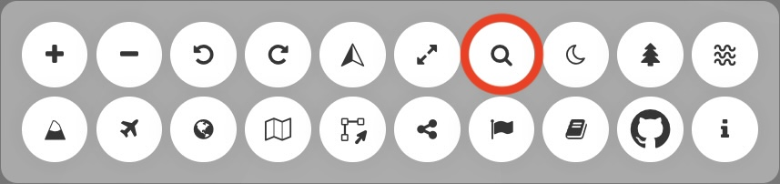
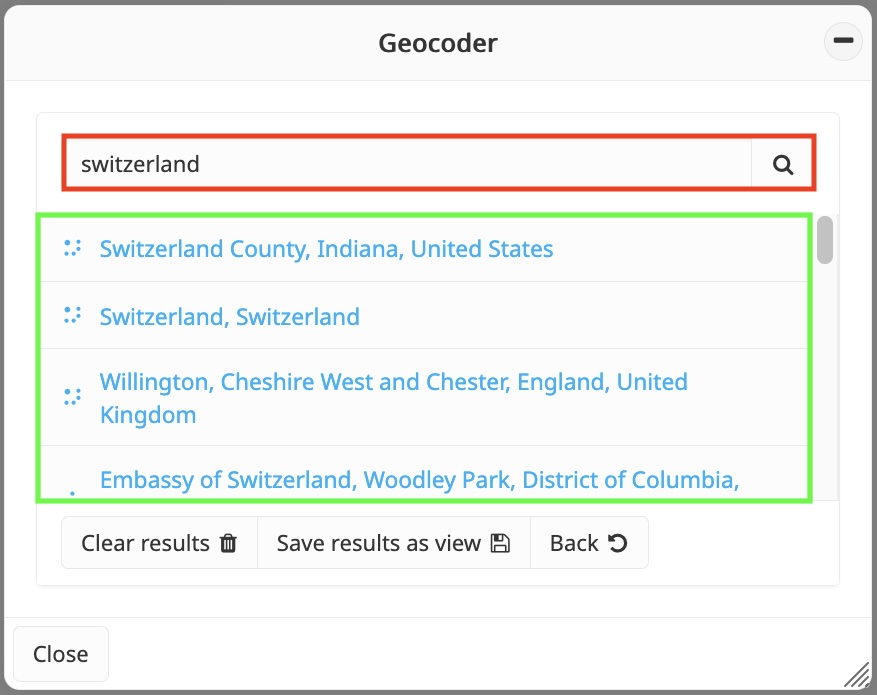
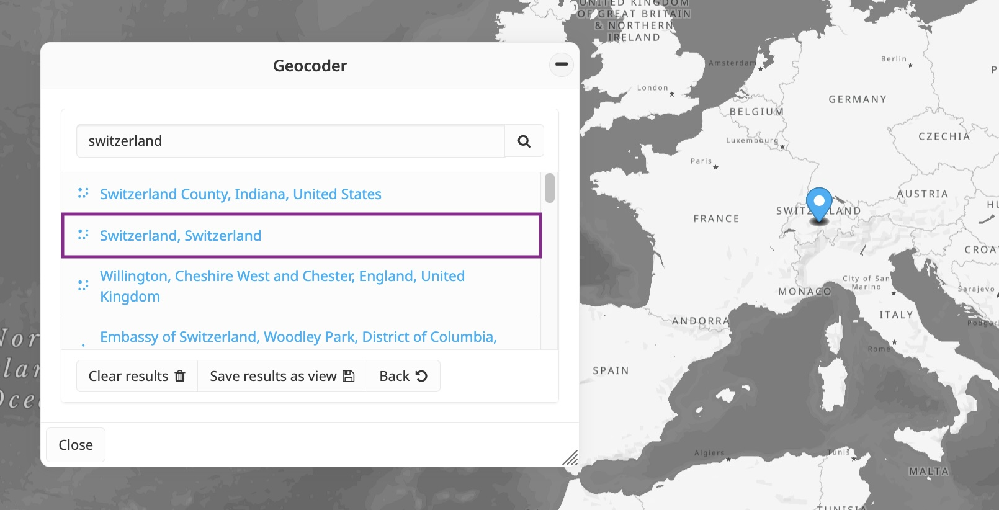
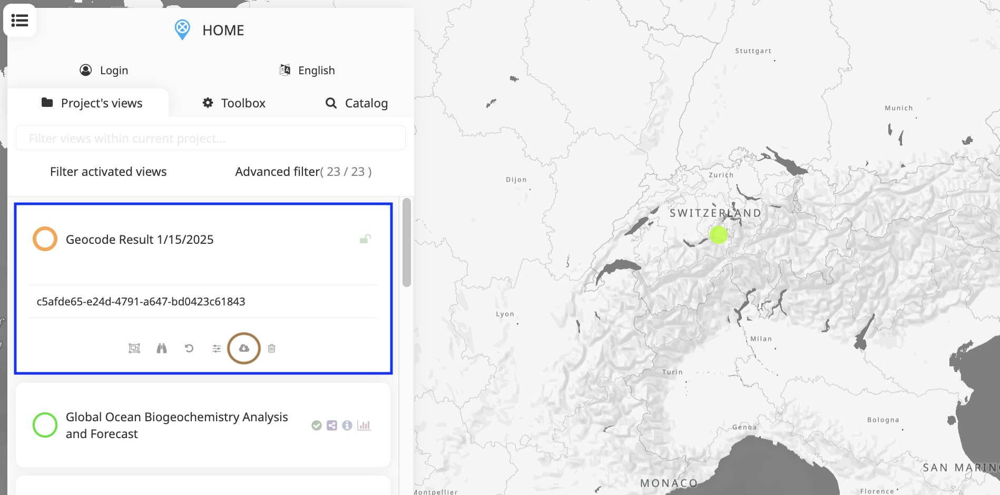

Geocoder
========

The **Geocoder** enables users to convert location text (e.g., country,
region, postal address) into geographic coordinates and access it in the map.
The search results are stored in a temporary layer, allowing users to download
them as a GeoJSON file or add them to the current project if their privileges
allow it (i.e., publisher, admin).

How to access a location with the Geocoder?
-------------------------------------------

Users regardless of their privileges can access the **Geocoder** from
the menu bar located in the top-right corner of the application.

   Location of the Geocoder in the menu bar

   Geocoder panel

When the **Geocoder** is activated, users can enter the desired location's name,
address, or any relevant text in the search bar (red square). After entering
the information, clicking the magnifier button or the ``Enter`` key will display
the search results (green square). To navigate to a specific location, simply
click on the corresponding result (purple square). The map will automatically
center on the selected location, and a marker will be added to indicate its
exact geographic position.  

   Visualization of a location in the map

How to preserve these locations?
--------------------------------

Users can perform multiple searches consecutively, and all clicked results are  
kept in the map. This feature allows users to revisit previous locations
by clicking the **Back** button. Additionally, the **Geocoder** provides
the option to generate a temporary view containing all visited locations
by clicking the **Save results as view** button. This view is automatically
added to the top of the data catalog (blue square), making it accessible to
all users for local download in ``GeoJSON`` format (brown circle). Publishers
and administrators also have the option to upload the temporary data to
the project for further use.  

   Temporary view created from the Geocoder
