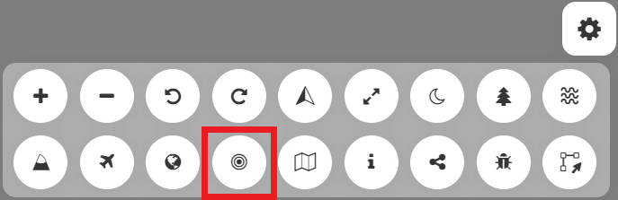
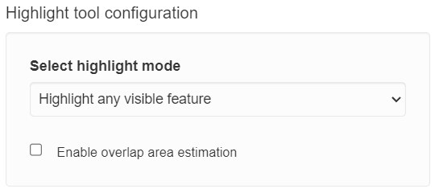
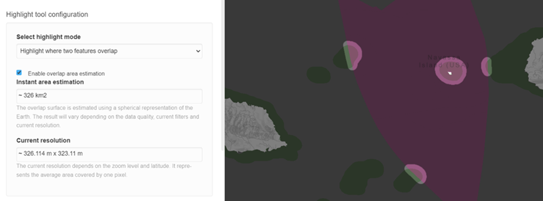
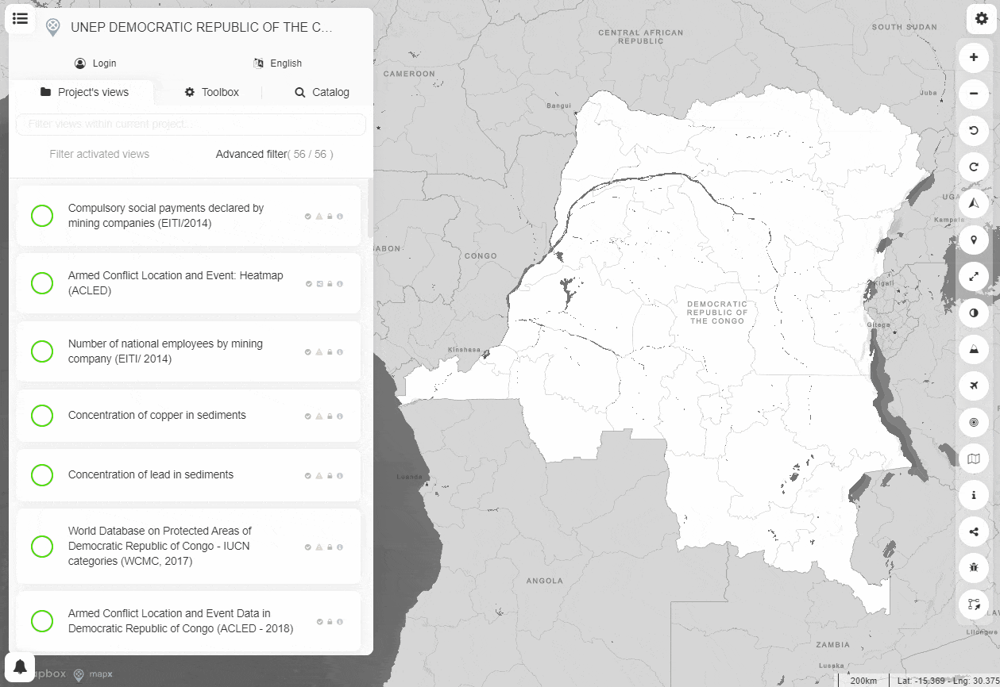

Highlight vector features tool
==============================

This **Highlight vector features** tool enables users to identify areas
where several layers overlap. The tool draws a highlight over the
overlapping data on map and shadows the rest of the data. The tool only
accepts vector tiles views as input data, but it is fully responsive to
any change to the data displayed on map through filtering processes.

.. note::
   For technical reasons, this tool is currently disabled in non-blink
   browsers (i.e., Safari, Firefox).

How do I use the Highlight vector features tool?
------------------------------------------------

Before activating the tool from the **Menu bar**, define the “highlight
mode” - minimum number of overlapping layers to be highlighted - in the
**Toolbox** and activate the views that you want to overlap.

   Highlight vector features tool.

   Highlight tool configuration.

The tool additionally offers an option to estimate the overlapping area.
Please note that the area estimate only takes into account what is
displayed on the screen and not the complete datasets. Values are
updated automatically when the position or the zoom in the map are
modified by the users.

   Area estimation.

.. warning::
   This tool should be used for preliminary investigation. It uses the
   approximated area of spatial features and is therefore not suitable for
   reporting.

Example of use
--------------

   Overlap area estimation.

