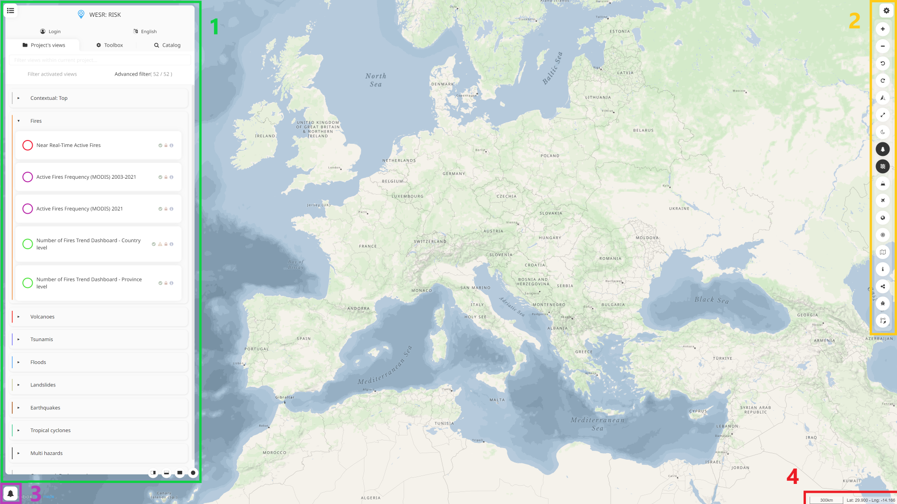

User interface
===================

MapX is a web application constituted by an interactive map where
geospatial layers can be displayed, a data catalog environment, and a
set of functionalities (tools) to, among other things, interrogate,
interact, export the data displayed in the map.

   MapX user interface elements

The MapX user interface is made up of 4 distinct elements which complete
the interactive map and which are:

1. The **Work environment** contains several key elements of MapX: the
   **Data catalog** which allows users to select views to display on the
   map, the **Toolbox** and the **Search tool**. This environment also
   allows users to register in the application, select a project to
   explore and change the interface language.
2. The **Menu bar** contains the **Navigation buttons** that allow
   interaction with the map (e.g., zoom, rotation, theme, globe mode) and
   provides access to some of the MapX tools such as the **Map
   composer** or the **Sharing tool**.
3. The **Notification panel** informs users if an error has occurred in
   MapX. In addition, some tools (e.g., download) send information to
   users via the notification system.
4. The scale of the map as well as the coordinates of the pointer are
   displayed in this area.

.. hint::
   Except for the scale and pointer coordinates, other interface
   elements can be hidden by clicking on the square buttons located in the
   corners of the application.

.. toctree::
   :titlesonly:
   :glob:

   work-environment
   toolbox-basics
   search-tool
   menu-bar
   map-composer
   draw-tool
   sharing-manager
   highlight-vector-features