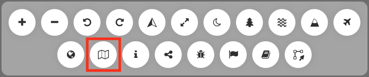

Map Composer
============

MapX enables users to create, customize and download maps on the
platform through the **Map Composer** tool. The **Map Composer** exports
all views displayed on the screen as well as the legends, abstracts and
titles in PNG format. The tool is interactive and allows users to define
the map resolution and to edit both the map layout and content.

General description
-------------------

The **Map Composer** is an interactive workspace allowing to define the
dimensions and spatial extent of the data frame as well as the layout of
other cartographic elements (title, legend(s), abstract(s)). Menu bars
are present on each side of the window and allow to manage the
dimensions and the resolution of the final product (left-side bar) and
the style of text elements (right-side bar). The part of the workspace
that will be exported as a map is highlighted with a red border and a
white background.

.. figure:: ./img/map-composer-layout.png
   :align: center
   :class: with-shadow

   Map composer layout

How do I use the map composer?
------------------------------

The **Map Composer** can be accessed from the menu located on the
right-side of your screen.

   Map Composer icon in the menu bar

Before using the tool, activate all the views that will be exported on
the map and choose carefully the order in which they are displayed on
the map. This order will be saved on the **Map Composer** and cannot be
modified while creating the map. Note that the cartographic elements
(scale, north arrow, etc) will be loaded automatically into the **Map
Composer**.

How do I set up the map dimensions?
~~~~~~~~~~~~~~~~~~~~~~~~~~~~~~~~~~~

You can modify and adjust the size of the map using two different
methods:

1. Using the left-side bar:

   1. Predefined dimensions (default): to facilitate the map export in a
      standard print format or for a specific screen size, presets are
      available. By selecting a format from the **Predefined dimensions**
      drop-down list, the height, width, resolution and physical measurement
      of the map will automatically be set. The printing resolution is
      automatically set to 300 dpi when a standard print format is selected.

      .. figure:: ./img/map-composer-presets.gif
         :align: center
         :class: with-shadow

   2. Manual input:
   
      1. Define the size of your map by choosing the height and width in
         pixel. This option can be useful if your map is viewed on a
         digital device (computer, tablet, phone).
   
         .. figure:: ./img/map-composer-manual.gif
            :align: center
            :class: with-shadow
   
      2. Define the size of your map by choosing the height and width in
         physical measurement (inches or millimeters). When this option is
         selected, the tool automatically calculates the size of the export
         in pixels to satisfy the parameters you entered at a print
         resolution of 300 dpi. Once the paper settings are selected, the
         page will be automatically resized in the workspace.
   
         .. figure:: ./img/map-composer-manual-dims.gif
            :align: center
            :class: with-shadow
   
2. Adjusting manually the size of the page: drag the sides of the
   background page of your map using the handles. The values in the
   left-side bar will be updated accordingly.

   .. figure:: ./img/map-composer-resize.gif
      :align: center
      :class: with-shadow

Whatever the method used to define the size of the export, it is
possible to switch from portrait to landscape orientation by clicking on
the dedicated button.

.. figure:: ./img/map-composer-page-orientation.png
   :width: 180
   :align: center
   :class: with-shadow

   Portrait/landscape button

How do I design a new map?
~~~~~~~~~~~~~~~~~~~~~~~~~~

Several tools are available in the **Map Composer** to configure your
map. At any time, you can preview your work by selecting the **Preview**
mode in the left side bar.

.. figure:: ./img/map-composer-preview.png
   :width: 180
   :align: center
   :class: with-shadow

   Preview mode

You can edit the following components of the map:

-  **Position:** each element has a handle in its center allowing to
   re-position it.
-  **Size:** elements can be resized by dragging the handles located on
   each of their sides.
-  **Content scale:** the text (e.g., title, legend, map labels) and the
   icons can be scaled to best fit the size of the export.
-  **Zoom and map focus**: zoom in/out and move around the map to select
   the exact map position of your choice.
-  **Text parameters:** edit the text using the tools located on the
   right-side bar. Select different options to change the font, size,
   style and alignment of the text.
-  **Legends:** legends containing many classes can be re-organized in
   multiple columns using the **Legend columns** parameters located on
   the left-side bar.
-  **Text boxes:** additional text boxes can be added to the map from
   the right-side bar to add any important information that is not
   included in the preloaded elements.

.. figure:: ./img/map-composer-usage.gif
   :align: center
   :class: with-shadow

.. note::
   *not* all elements must appear on the map. If you don't want to
   use one of the elements displayed in your workspace, move it off the
   page (delimited by red border) to the darker area of the workspace using
   the center-handle. Alternatively, you can permanently delete an element
   from the **Map Composer** by clicking the **X** button located in its
   upper-right corner.

   .. figure:: ./img/map-composer-hide-element.png
      :width: 600
      :align: center
      :class: with-shadow
   
      Hiding cartographic element(s) from the export
   
   
   .. figure:: ./img/map-composer-remove-element.png
      :align: center
      :class: with-shadow
   
      Removing cartographic element(s) from the export

How do I export my map?
~~~~~~~~~~~~~~~~~~~~~~~

Once ready, click on the **Export image** button located on the
left-side bar to export your map in PNG format. The map is now available
in the “download” folder of your device.

License and data credits
------------------------

Make sure you checked the license of your data from the metadata window.
It indicates if the source layer(s) associated to the selected view(s)
is/are allowed to be exported. Any complementary information must be
included in the map if/as specified in the data license.
