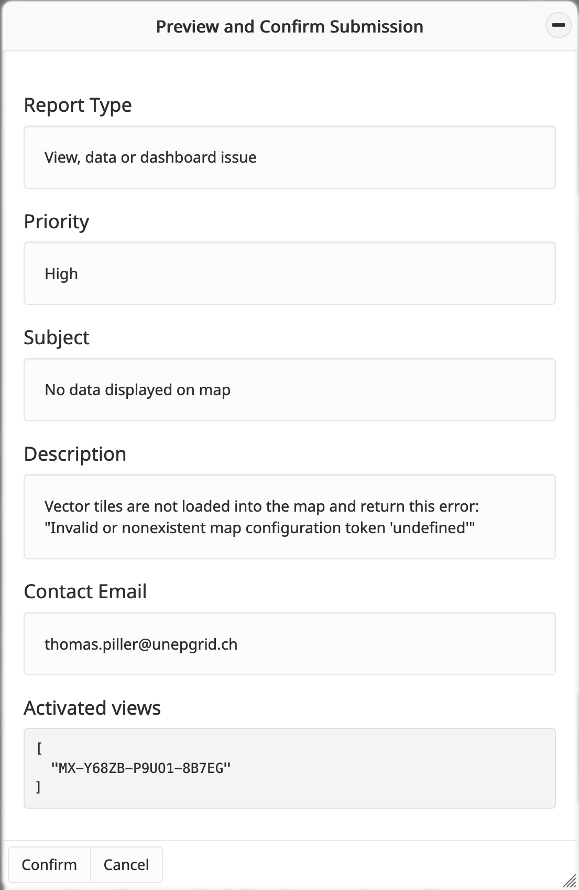

Report problematic content tool
===============================

The **Report problematic content tool** allows users to easily reach out to
the MapX team or project editors/administrators to report any issues or
concerns. Whether it's a problem with the application's functionality (e.g.,
user interface glitches, tool errors, translation mistakes) or content-related
concerns (e.g., incorrect data, maps, or dashboards), users can use this tool
to ensure that the development team is promptly informed.

How to report problematic content in MapX?
------------------------------------------

All users, regardless of their privileges, can access the **Report problematic
content tool** from the menu bar located on the right-side of your screen.

   Report problematic content icon in the menu bar

Once the tool is activated, users can create and submit a report through
a dedicated panel, with each input field explained in detail below.

   Report problematic content panel

.. _report-types:

1. Report type: four types of reports are available:
   
   1. Bug or feature request: This report is sent to the application developer
      to address bugs or suggest improvements. For bug reports, please provide
      detailed steps to reproduce the issue. Any error messages shown in
      the MapX interface (e.g., in the notification panel or a dedicated panel)
      should be included in the report.
   2. View, data or dashboard: This report is sent to the editor responsible
      for the selected views to fix data-related problems (e.g., broken views,
      missing or outdated data).
   3. Project: This report is directed to the project administrator for comments
      or concerns about the project's content or organization.
   4. Institutional: This report is sent to the MapX team for general
      information about the application, collaboration inquiries, or to
      report problematic content (e.g., prohibited material, misinformation,
      scientific errors).

2. Priority: Priority levels help determine how quickly a report needs to be
   addressed. These range from "Low" for minor issues to "High" for critical
   issues requiring urgent attention.

3. Include current activated views list: When this option is enabled,
   the reference (identifier and link) of the active views will be attached
   to your message. This option is mandatory for "Bug or Feature Request"
   reports.

4. Include map configuration: By enabling this option, the current map
   configuration (i.e., map extent, zoom, theme, globe mode, aerial view)
   will be attached to the report.

.. _contact-email:

5. Contact email: An email address for follow-up communication. If left blank,
   the report will be submitted anonymously.

6. Subject: The title or subject of your report.

7. Description: A detailed explanation of the issue or enhancement. See
   :ref:`Report types <report-types>` for relevant information to include.

Once the report is complete, click the "Submit" button. A summary of your
message will be displayed in the MapX interface, allowing you to review
and verify all details before sending. To finalize the submission, click
the "Confirm" button.

   Preview and confirmation panel

After submission, a confirmation message will be sent to the email address
provided in the :ref:`Contact email <contact-email>` field.

   Confirmation email

.. tip::
   If your report is not addressed within a reasonable time frame, you can
   forward the confirmation email (which includes the report ID) to the MapX
   team at: issues@mapx.org.
