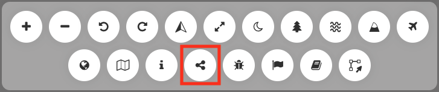
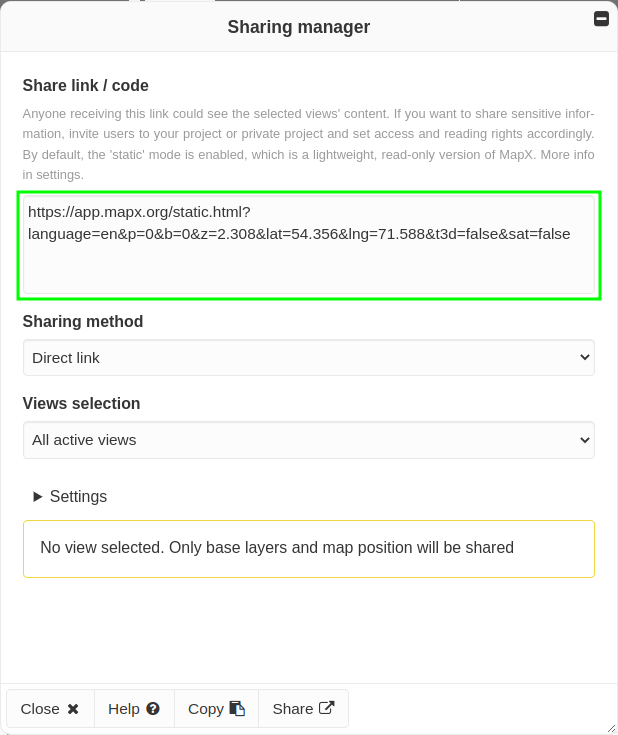

Sharing manager
===============

The **Sharing manager** enables users to create and customize links to
MapX content (i.e., views, story map, project) and share them by email or
on social networks.

.. warning::
   Anyone receiving a link generated by the **Sharing manager** will be
   able to access its content. If you want to share sensitive information,
   it is recommended to rather invite users to your project and set access
   and reading rights accordingly.

How to create a share link in MapX?
-----------------------------------

Users regardless of their privileges can access the **Sharing manager**
from the tool bar located in the top-right corner of the application.

   Location of the Sharing manager in the tool bar

Once the tool is activated, users can create and customize a share link
from a dedicated panel. The link is displayed in the upper part of the
panel (green square) and is updated in real time according to the
options selected in the different menus (more details in the following
sections).

   Sharing manager panel

Once the link has been created with all the desired options, it can be
shared either by clicking on the **Copy** button (copy to clipboard) or
**Share** button (dynamic action opening the selected application).

Options
~~~~~~~

Sharing method
^^^^^^^^^^^^^^

Several sharing methods are available:

-  direct link (copy to clipboard)
-  iFrame (to easily embed MapX content in a web page)
-  email and messaging applications (e.g., WhatsApp, Skype, Telegram)
-  social network (e.g., Linkedin, Reddit, Facebook)

.. note::
   It is possible to share a link using several methods in a row while
   keeping the options selected.

Views selection
^^^^^^^^^^^^^^^

This drop-down list allows users to define the content that will be
shared in the link. The options available may vary depending on the
environment from which the **Sharing manager** is activated (i.e., MapX,
static mode and story map playback).

In most cases, only the **All active views** option is available. In
that case, views activated in the catalog will be displayed by default
in the map when a user consults the link. If no view is selected in the
catalog, the whole project is shared.

When MapX content is consulted using the **static** mode, as there is no
catalog strictly speaking, only the views displayed in the map can be
shared using the **Views set in the current URL** option.

When reading a story map, it is possible to use the sharing manager to
either share the story map itself (**This Story Map**) or share all
views displayed in the map at a given step (**Active views in the
current step**).

Settings
^^^^^^^^

1. Share in **static** mode

   This option which is enabled by default is recommended for sharing
   MapX content. It uses a lightweight version of MapX with limited
   functionalities. In case a story map is shared in **static** mode, it
   will start automatically.

2. Set initial map position

   When this option is enabled, the current extent, tilt and bearing of
   the map will be used to set the initial position of the map when
   accessing the link. Project defaults are thus overwritten.

   .. note::
      When this option is enabled, it is also possible to activate the
      **3D terrain mode** and/or the **Aerial theme** from the menu bar
      located in the top-right corner of the application.

3. Limit map panning to current extent

   When this option is enabled, the map will be constrained to its
   current extent thereby limiting what users viewing the link will see.

   .. note::
      When this option is enabled, the globe mode is automatically
      disabled as it cannot be constrained by an extent.

4. Zoom to all views extent, starting from initial position.

   The extent of all views displayed in the map will be computed. A zoom
   will be made from the initial position of the map (project defaults
   or user defined) to the views extent. If no view is selected, this
   option is ignored.

5. Hide categories

   When enabled, categories will be hidden if the complete catalog is
   consulted.
