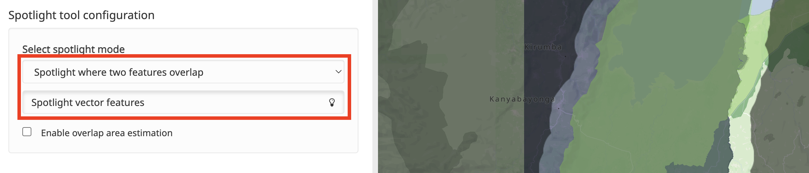
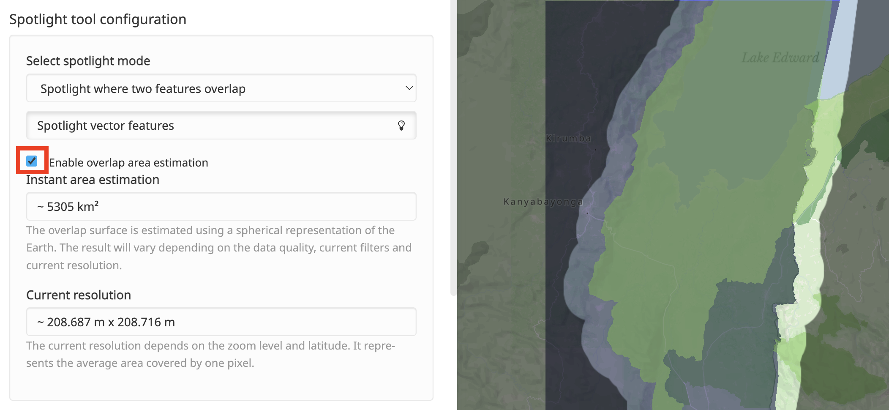

Toolbox (basics)
================

The toolbox offers users a series of tools for creating and editing
content in MapX, managing projects and members, and perform some basic
analysis on their data. Depending on the user's role in the project, the
list of available tools varies. The tools presented in this section are
those available to users with a public role. Advanced tools are
presented and described in the :doc:`Advanced tools <../advanced-tools/index>` chapter.

.. only:: html

   .. figure:: ./img/toolbox-basic.png
      :width: 400
      :align: center
      :class: with-shadow

      Toolbox basic tools

.. only:: latex

   .. figure:: ./img/toolbox-basic.png
      :width: 9cm
      :align: center
      :class: with-shadow

      Toolbox basic tools

Spotlight tool
--------------

The **Spotlight** tool enables users to identify areas where several
layers overlap. The tool draws a highlight over the overlapping data
on map and shadows the rest of the data. The tool only accepts vector
tiles views as input data, but it is fully responsive to any change to
the data displayed on map through filtering processes.

.. note::
   For technical reasons, this tool is currently disabled in non-blink
   browsers (i.e., Safari, Firefox).

How do I use the Spotlight tool?
~~~~~~~~~~~~~~~~~~~~~~~~~~~~~~~~

First, activate the views that you want to overlap from the **Data catalog**.
Then, define the “highlight mode” - minimum number of  overlapping layers
to be highlighted - from the **Toolbox**. Finally, activate the analysis
by pressing the “Spotlight vector features” button.

   Highlight tool configuration

The tool additionally offers an option to estimate the overlapping area.
Please note that the area estimate only takes into account what is
displayed on the screen and not the complete datasets. Values are
updated automatically when the position or the zoom in the map are
modified by the users.

   Area estimation

.. warning::
   This tool should be used for preliminary investigation. It uses the
   approximated area of spatial features and is therefore not suitable for
   reporting.

.. only:: html

   Example of use
   ~~~~~~~~~~~~~~

   .. figure:: ./img/spotlight-usage.gif
      :align: center
      :class: with-shadow

      Overlap area estimation

Utilities
---------

1. **URL Mirror helper**: MapX requires that the connection to external
   resources (e.g., web services, APIs) be secure (i.e., https) and that
   `CORS <https://developer.mozilla.org/en-US/docs/Web/HTTP/CORS>`__ be
   enabled. To bypass this restriction, a system has been developed by
   the MapX team which allows to generate a valid link from any URL.
2. **Clear cached data**: This tool allows to remove all cached data set
   by MapX, including map tiles, GeoJSON layers, drafts, WMS responses,
   summaries and custom scripts. This tool will only impact data stored
   in the user's browser. No data will be removed server side.
3. **Reset default panel sizes**: Panels and menu bars can be resized in
   MapX. All modifications made by the users are cached in their browser
   to keep them from session to session. This tool simply allows users
   to reset the interface of MapX.
4. **Get search API key and configuration**: All the information to use
   the MapX search tool API is provided in this tool. The API technical
   documentation is available
   `here <https://github.com/unep-grid/mapx/wiki/Search-tool-API>`__.
5. **Theme configuration**: The MapX user interface as well as the
   basemap can be customized from this tool. For each element, users can
   enable/disable its display, and change its color and/or opacity. If
   the element is a text/label, its font can also be changed. These
   modifications are only effective during the current session and will
   therefore not be preserved if MapX is reloaded. However, if you want
   to keep your custom theme for future sessions, it is possible to
   export it in ``JSON`` format on your computer and then import it as
   needed.
6. **MapX version and changelog**: This tool allows users to consult the
   version of MapX they are using as well as the change-log of the
   application listing all the improvements, bug fixes and new
   functionalities deployed over the versions.

.. only:: html

   .. figure:: ./img/changelog.png
      :width: 400
      :align: center
      :class: with-shadow

      MapX changelog

.. only:: latex

   .. figure:: ./img/changelog.png
      :width: 8cm
      :align: center
      :class: with-shadow

      MapX changelog
