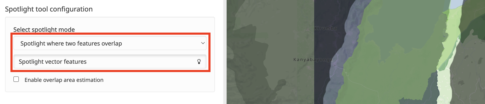
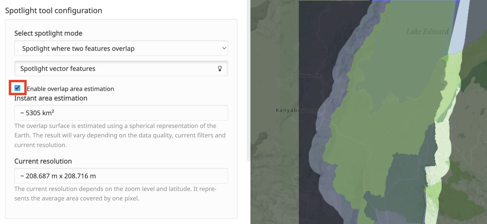

Toolbox (basics)
================

The toolbox offers users a series of tools for creating and editing
content in MapX, managing projects and members, and perform some basic
analysis on their data. Depending on the user's role in the project, the
list of available tools varies. The tools presented in this section are
those available to users with a public role. Advanced tools are
presented and described in the :doc:`Advanced tools <../advanced-tools/index>`
chapter.

.. only:: html

   .. figure:: ./img/toolbox-basic.png
      :width: 400
      :align: center
      :class: with-shadow

      Toolbox basic tools

.. only:: latex

   .. figure:: ./img/toolbox-basic.png
      :width: 9cm
      :align: center
      :class: with-shadow

      Toolbox basic tools

Spotlight tool
--------------

The **Spotlight** tool enables users to identify areas where several
layers overlap. The tool draws a highlight over the overlapping data
on map and shadows the rest of the data. The tool only accepts vector
tiles views as input data, but it is fully responsive to any change to
the data displayed on map through filtering processes.

.. note::
   For technical reasons, this tool is currently disabled in non-blink
   browsers (i.e., Safari, Firefox).

How do I use the Spotlight tool?
~~~~~~~~~~~~~~~~~~~~~~~~~~~~~~~~

First, activate the views that you want to overlap from the **Data catalog**.
Then, define the “highlight mode” - minimum number of  overlapping layers
to be highlighted - from the **Toolbox**. Finally, activate the analysis
by pressing the “Spotlight vector features” button.

   Highlight tool configuration

The tool additionally offers an option to estimate the overlapping area.
Please note that the area estimate only takes into account what is
displayed on the screen and not the complete datasets. Values are
updated automatically when the position or the zoom in the map are
modified by the users.

   Area estimation

.. warning::
   This tool should be used for preliminary investigation. It uses the
   approximated area of spatial features and is therefore not suitable for
   reporting.

.. only:: html

   Example of use
   ~~~~~~~~~~~~~~

   .. figure:: ./img/spotlight-usage.gif
      :align: center
      :class: with-shadow

      Overlap area estimation

Utilities
---------

1. **URL Mirror helper**: MapX requires that the connection to external
   resources (e.g., web services, APIs) be secure (i.e., https) and that
   `CORS <https://developer.mozilla.org/en-US/docs/Web/HTTP/CORS>`__ be
   enabled. To bypass this restriction, a system has been developed by
   the MapX team which allows to generate a valid link from any URL.
2. **Clear cached data**: This tool allows to remove all cached data set
   by MapX, including map tiles, GeoJSON layers, drafts, WMS responses,
   summaries and custom scripts. This tool will only impact data stored
   in the user's browser. No data will be removed server side.
3. **Reset default panel sizes**: Panels and menu bars can be resized in
   MapX. All modifications made by the users are cached in their browser
   to keep them from session to session. This tool simply allows users
   to reset the interface of MapX.
4. **Get search API key and configuration**: All the information to use
   the MapX search tool API is provided in this tool. The API technical
   documentation is available
   `here <https://github.com/unep-grid/mapx/wiki/Search-tool-API>`__.
5. **MapX version and changelog**: This tool allows users to consult the
   version of MapX they are using as well as the change-log of the
   application listing all the improvements, bug fixes and new
   functionalities deployed over the versions.

.. only:: html

   .. figure:: ./img/changelog.png
      :width: 500
      :align: center
      :class: with-shadow

      MapX changelog

.. only:: latex

   .. figure:: ./img/changelog.png
      :width: 8cm
      :align: center
      :class: with-shadow

      MapX changelog

Theme configuration
-------------------

The **Theme manager** enables users to customize the MapX interface and basemap.
Users can select an existing theme for the current session, modify it, or create
a new one. For each element, users can toggle its visibility and adjust
its color and opacity. Text and label elements also allow font customization.
Multiple themes can be created and saved either for the current session or
locally in the browser. Project administrators can leverage the **Theme
manager** to create and assign a default theme for their project.

How do I use the Theme manager?
~~~~~~~~~~~~~~~~~~~~~~~~~~~~~~~~

.. only:: html

   .. figure:: ./img/theme-manager.jpg
      :width: 500
      :align: center
      :class: with-shadow

      MapX Theme Manager

.. only:: latex

   .. figure:: ./img/theme-manager.jpg
      :width: 10cm
      :align: center
      :class: with-shadow

      MapX Theme Manager

1. **Theme selection:** This field allows you to select the theme to edit.
   By default, the current theme is selected in the manager.
2. **Search:** This field enables keyword-based searching within the editable
   elements of the theme.
3. **Editable elements:** Interface or basemap elements that can be edited.
   For each element, you can toggle visibility and adjust color and opacity.
4. **Font selection:** For text and label elements, the font can be modified
   using the dropdown list.
5. **Theme management tools:**

   1. **Close:** Closes the **Theme manager**.
   2. **Import:** Imports a local theme (from your computer) into the manager
      in ``JSON`` format.
   3. **Export:** Saves a theme locally (to your computer) in ``JSON`` format.
   4. **Duplicate:** Copies and saves the currently selected theme with
      your modifications.

      .. only:: html

         .. figure:: ./img/theme-manager-duplicate.png
            :width: 400
            :align: center
            :class: with-shadow

            Theme Storage Location

      .. only:: latex

         .. figure:: ./img/theme-manager-duplicate.png
            :width: 8cm
            :align: center
            :class: with-shadow

            Theme Storage Location

      The duplication process requires the user to define an ID, a label, and
      a description for the new theme. By default, the values shown in the panel
      are those of the theme being copied.
      
      The lower part of the panel (highlighted in blue) allows you to configure
      the combination of :ref:`Navigation buttons <navigation-buttons>`, enabled
      or disabled, that will trigger the display of your theme.
      Other combinations will display the default MapX themes. 

      Once created, the following options are provided for saving a theme:

      .. only:: html

         .. figure:: ./img/theme-manager-storage.png
            :width: 400
            :align: center
            :class: with-shadow

            Theme Storage Location

      .. only:: latex

         .. figure:: ./img/theme-manager-storage.png
            :width: 8cm
            :align: center
            :class: with-shadow

            Theme Storage Location

      - **Session, temporary:** The theme will only be available for the current
        session and will be removed if the project is changed or MapX is
        restarted.
      - **This device, any project:** The theme will be stored locally in your
        browser and will be accessible across all projects.
      - **Database, for this project:** The theme will be saved permanently to
        the MapX database. Currently, only project administrators can perform
        this action.

   5. **Update:** Modifies an existing theme.
   6. **Delete:** Deletes a theme. Default MapX themes and the theme set as
      the project default cannot be deleted.

      .. warning::
         Deletion is permanent and cannot be undone!