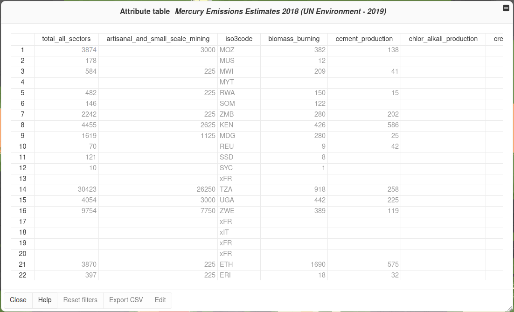
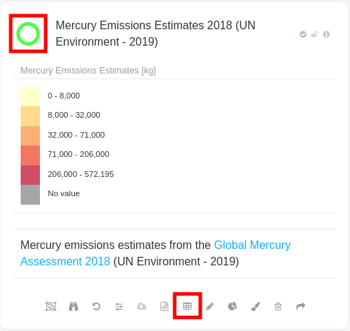
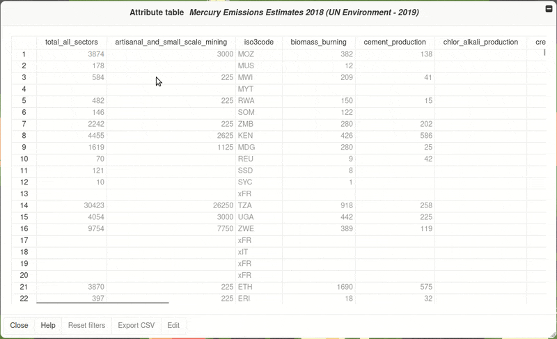
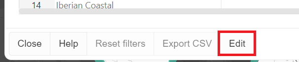

Attribute table
===============

MapX enables users to access the attribute table of vector views from
the data catalog. This tool allows users to visualize and extract the
data in tabular format.

General description
-------------------

The attribute table is an interactive workspace allowing to access the
tabular data of the view. Each row in the table represents a feature
displayed in the map and each column contains a specific information
about the feature. Features in the table can be easily sorted.

   Attribute table layout

How do I use the attribute table?
---------------------------------

Only vector type views provide the ability to access their attribute
table. They are identifiable in the data catalog by their green color
(circle to the left of their title). Once a vector view is open, its
attribute table can be accessed via the dedicated button in the options
bar.

   Attribute table icon

How can I sort the data?
~~~~~~~~~~~~~~~~~~~~~~~~

Click on the header of the column. Depending on the type of your data,
sorting will be done by:

-  alphabetical order (A to Z OR Z to A)
-  numerical order (lower to higher OR higher to lower values)

How do I export the data I just filtered?
~~~~~~~~~~~~~~~~~~~~~~~~~~~~~~~~~~~~~~~~~

Click on the button **Export CSV** located at the bottom of the modal
panel to export your data in CSV format. If the button is grayed out, it
means that the data license does not allow data to be downloaded. The
file should be available in the download folder of your device.

.. _edit-attribute-table:

How can I edit the content of the attribute table?
~~~~~~~~~~~~~~~~~~~~~~~~~~~~~~~~~~~~~~~~~~~~~~~~~~

If you have editing rights on the data source, the **Edit** button
located at the bottom of the panel will be active and by clicking on it,
you will automatically load the current data source into the **Edit
vector source** tool. Please refer to the
:doc:`Edit vector source <../sources/edit-vector-source>` section
for more information.

   Shortcut to vector source editing tool

