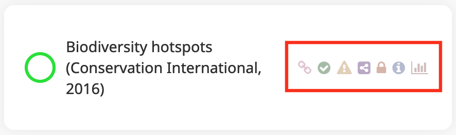

Badges
======

Each view is coupled with a series of badges giving users key
information about the view. These badges are displayed to the right of
the view title.

   Badges of a view

The badges that can be displayed in a view are the following:

+------------+---------------------------------------------------------+
| Badge      | Description                                             |
+============+=========================================================+
| |image1|   | This view is temporarily associated with the current    |
|            | project. If MapX is reloaded, it will no longer be      |
|            | displayed.                                              |
+------------+---------------------------------------------------------+
| |image2|   | By clicking on this badge, users can consult the        |
|            | metadata of the view as well as that of the data        |
|            | source.                                                 |
+------------+---------------------------------------------------------+
| |image3|   | By clicking on this badge, users can consult the view   |
|            | visualization statistics.                               |
+------------+---------------------------------------------------------+
| |image4|   | This badge indicates to the user whether or not they    |
|            | can edit the view.                                      |
|            |                                                         |
|            | .. warning::                                            |
|            |    Views shared from other projects cannot be edited    |
|            |    outside of the main project.                         |
+------------+---------------------------------------------------------+
| |image5|   | This view was shared from another project.              |
+------------+---------------------------------------------------------+
| |image6|   | This view is public and can be visualized by all MapX   |
|            | users regardless of their role.                         |
+------------+---------------------------------------------------------+
| |image7|   | This view is public but some metadata fields have not   |
|            | been filled in. To find out which fields are missing,   |
|            | just click on the badge.                                |
+------------+---------------------------------------------------------+

