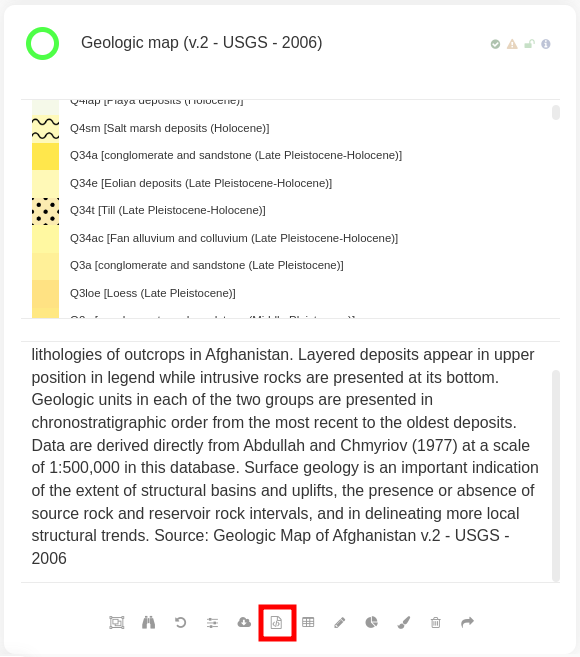
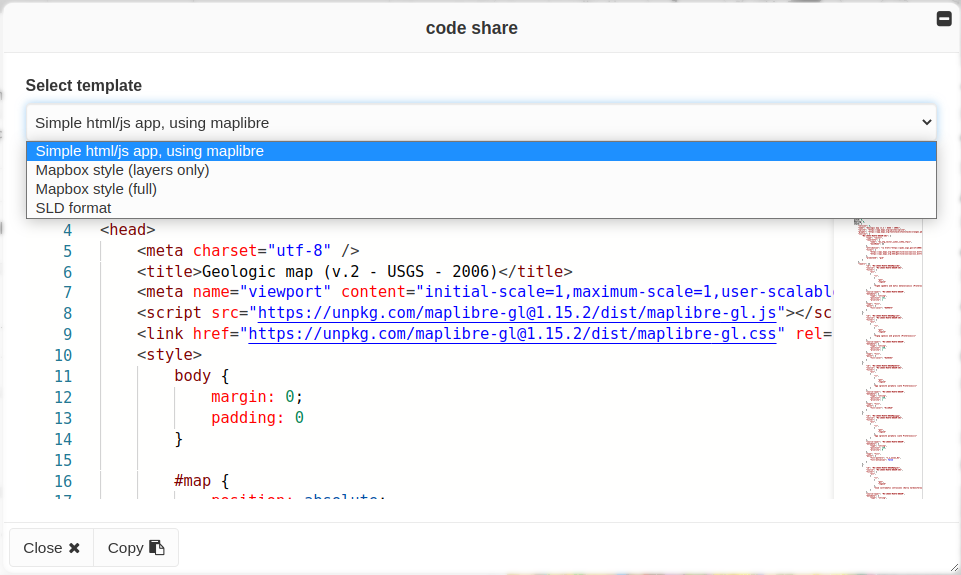

Code share tool
===============

The **Code share** tool is an interactive workspace allowing users to
copy the style of a MapX view and use it in diverse contexts. Only
vector type views provide the ability to access this tool. They are
identifiable in the data catalog by their green color (circle to the
left of their title). Once a vector view is open, the **Code sharing**
tool table can be accessed via the dedicated button in the options bar.

   Code share icon

   Code share layout

The **Code share** tool allows users to export the style in several
formats which are described in the following sections:

1. **Simple html/js app, using maplibre**: this option allows to copy
   the code of a basic but complete web page which displays the view.
   `Maplibre <https://maplibre.org/>`__ and the MapX API are used to
   display the map in an interactive way.

   .. figure:: ./img/code-share-jsfiddle.png
      :align: center
      :class: with-shadow

      JSFiddle integration example

2. **Mapbox style (layers only)**: this option allows to copy the code
   of all `Mapbox <https://www.mapbox.com/>`__ layers composing the view
   knowing that each rule defined in the style of the view corresponds
   to a layer (`link to the Mapbox documentation
   <https://docs.mapbox.com/mapbox-gl-js/style-spec/layers/>`__).
   

3. **Mapbox style (full)**: this option allows to copy the code of the
   complete `Mapbox <https://www.mapbox.com/>`__ style (source & layers)
   of the view. This option can be useful for integrating MapX content
   into another cartographic application based on Mapbox.

4. **SLD format**: the last option allows to copy the style of the view
   as a Styled Layer Descriptor (SLD). This format is supported by
   multiple open source softwares:
   `QGIS <https://www.qgis.org/fr/site/>`__,
   `GeoServer <https://geoserver.org/>`__,
   `MapServer <https://mapserver.org/>`__.

   .. figure:: ./img/code-share-qgis.gif
      :align: center
      :class: with-shadow

      Style integration in QGIS

