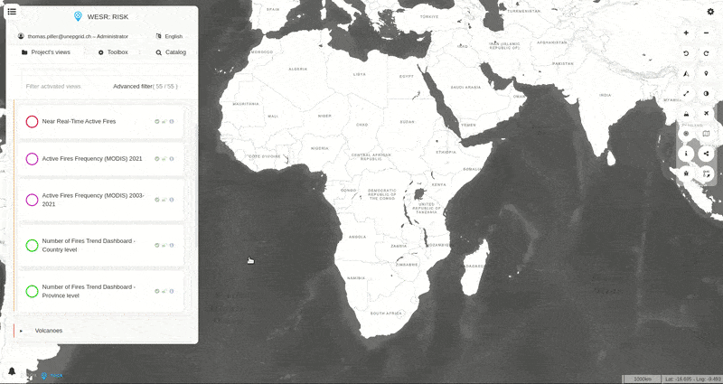

Dashboards
==========

.. warning::
   To maintain the environment as flexible as possible, the creation and
   edition of dashboard is addressed to developers as coding skills are
   needed (JavaScript, HTML, CSS) but all users can interact with them
   regardless of their technical level.

In MapX, a dashboard is an informative environment which can be
developed/coded in a view by publishers to complement and/or synthesize
the information displayed on the map. It is composed of one or several
elements called widgets which can contain for example an interactive
graphic, some text, an image or even a video. Data from the view as well
as data and/or media from external sources can be used in a dashboard to
present relevant information to users. Dashboards can be used for
example to show aggregated data at different geographic scales (e.g.,
global, national, local), temporal trends or the distribution of a
variable by category (e.g., exports by sector of activity). There is
almost no restriction on the way data can be processed (except for
spatial operations) and then displayed in a dashboard.

As a dashboard is necessarily associated with a view, it is
automatically displayed in the MapX interface when the view is opened
from the data catalog. It can be resized from its active vertices,
hidden by clicking on the icon in the bottom-right corner and even
rearranged by the user (move and delete widgets). These actions are
temporary and do not affect other users. The dashboard returns to its
initial state when the view is consulted again.

   Interactions with a dashboard

In a dashboard, each widget can display data based on two major types of
interactions with the map:

1. Static widgets show values that do not change with zoom or at click.
   Simply put, there is no interaction with the map.
2. Dynamic widgets allow interacting with the map through:

   1. zooming in and out
   2. clicking on specific features
   3. mouse hovering over specific features

The majority of widgets in MapX interact with the map via a click to
display item-specific data in the widget.

If you are interested in developing your own dashboards, please contact
the MapX team at: info@mapx.org.
