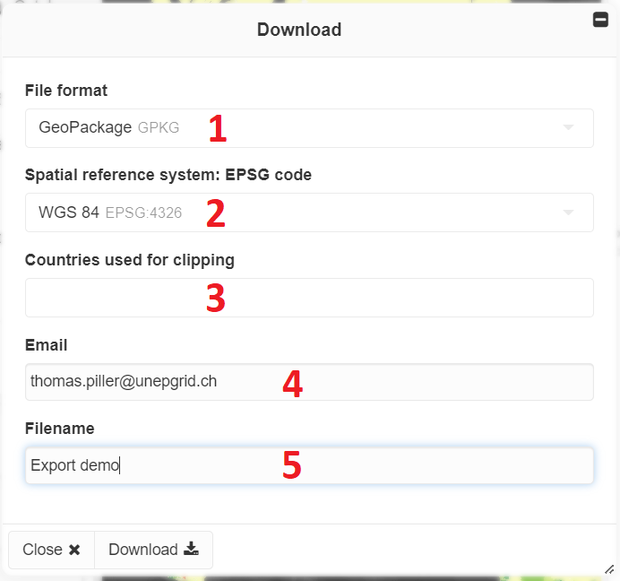
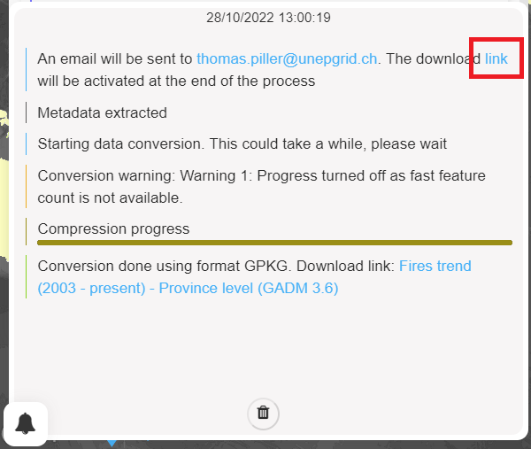
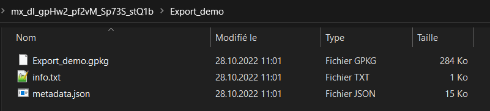

Download tool
=============

The **Download tool** enables users to export the dataset(s) associated
with a view. Depending on the type of view, the tool may either provide
a download link to an external resource (raster and custom code views)
or an interactive interface to download data from the MapX database with
customizable options (vector tiles views).

How do I use the Download tool?
-------------------------------

The **Download tool** is accessible from each view but is not
necessarily active. Depending on the data license, the download may not
have been authorized by the data publisher. In this case, the tool is
grayed out in the MapX interface.

Vector views
~~~~~~~~~~~~

   Download tool interface for vector views

To export a dataset from a vector view, you must:

1. Select the output file format. The MapX team recommends exporting
   data in GeoPackage (GPKG) format. Details on the file formats
   supported by MapX are available in the
   :ref:`Supported formats <supported-formats>` section.
2. Select the Spatial Reference System (SRS) of the export. By default
   the data is exported in `WGS 84 <https://epsg.io/4326>`__
   (EPSG:4326), the SRS in which spatial data is stored in the MapX
   database. By specifying another SRS, the **Download tool** will
   project the data during the export.
3. Select a list of countries for clipping the export *[optional]*. If
   left blank, the entire dataset will be exported. National
   administrative boundaries come from `GAUL
   2015 <https://data.apps.fao.org/map/catalog/srv/eng/catalog.search?id=12691#/metadata/9c35ba10-5649-41c8-bdfc-eb78e9e65654>`__.

   .. figure:: ./img/download-clip-countries.png
      :width: 450
      :align: center
      :class: with-shadow

      List of countries for clipping the export

4. Enter an email address which will be used to notify you that the file
   is available for download. By default, the email address of the MapX
   account is used.
5. Enter an export file name. By default, the data source name is used.

Once the export has been configured, the process can be launched by
clicking on the **Download** button. The export status can be consulted
from the notification panel (available from bottom-left corner). Once
the export completed, the file can be downloaded either from the
notification panel or from the link sent automatically by email.

   Notification panel

The downloaded ``ZIP`` folder contains:

   Content of the ZIP folder

1. the data in the selected format
2. the source metadata in ``JSON`` format (``metadata.json``)
3. an ``info.txt`` file containing the export date

Raster and custom code views
~~~~~~~~~~~~~~~~~~~~~~~~~~~~

If the view is of the raster or custom code type, the download tool will
display a simple link to an external resource. It can either be a
download link or a link to a web page where the data is available.

.. figure:: ./img/download-external-link.png
   :width: 600
   :align: center
   :class: with-shadow

   Download tool interface for raster and custom code views

