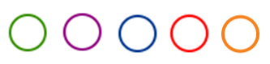
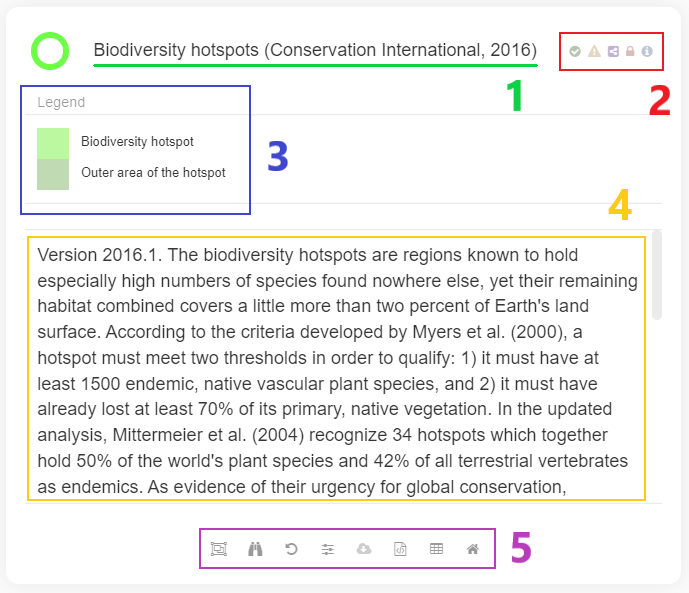

Views
=====

A two levels-data management system exists in MapX: “sources” and
“views”. Simply put, sources are raw spatial data stored in the MapX
database while views are a cartographic representation of it. As you
will see below, the concept of view can go beyond this simple
definition.

The different types of views available in MapX are:

-  `Vector
   tiles <https://docs.mapbox.com/help/glossary/vector-tiles/>`__
   **views** are used to display on the map data published in the MapX
   database.
-  `Raster <https://docs.mapbox.com/help/glossary/raster/>`__ **views**
   are based on external data services as MapX does not support raster
   storage.
-  **Custom coded views** are fully customisable views that allow, among
   other things, to display data from external sources or to implement
   advanced features (e.g., drop-down list, slider). Advanced knowledge
   in web development is required to code this type of view.
-  **Story maps** are communication products consisting of a mix of
   spatial data and other types of information (text, images, graphes,
   videos).
-  **Local GeoJSON views** are a special type of view allowing users to
   visualize their vector data without having to upload it to the MapX
   database. The data is thus temporarily stored in the user's browser.

The different view types are identifiable in MapX by the color of the
circle displayed to the left of their title: - green: vector - purple:
raster - blue: story map - red: custom code - orange: local GeoJSON

   Types of view

In the MapX interface, a view is presented as follows in the data
catalog:

   Anatomy of a View

1. view title
2. badges associated with the view
3. legend of the style applied to the data
4. abstract providing users with key information to understand the data
5. tools associated with the view

To display the data associated with a view on the map, simply click the
button next to the view's title. Multiple views can be activated at the
same time. When this is the case, the order in which views are displayed
in the map is defined by the position of the views in the catalog. It is
possible to modify the order by grabbing the view with the pointer and
dragging it in the catalog to change its position.

.. toctree::
   :titlesonly:
   :glob:

   badges
   tools
   querying-filtering-data
   publication-new-view
   dashboard
   sharing-views-projects
   download-tool
   attribute-table
   code-share
