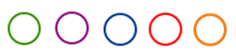
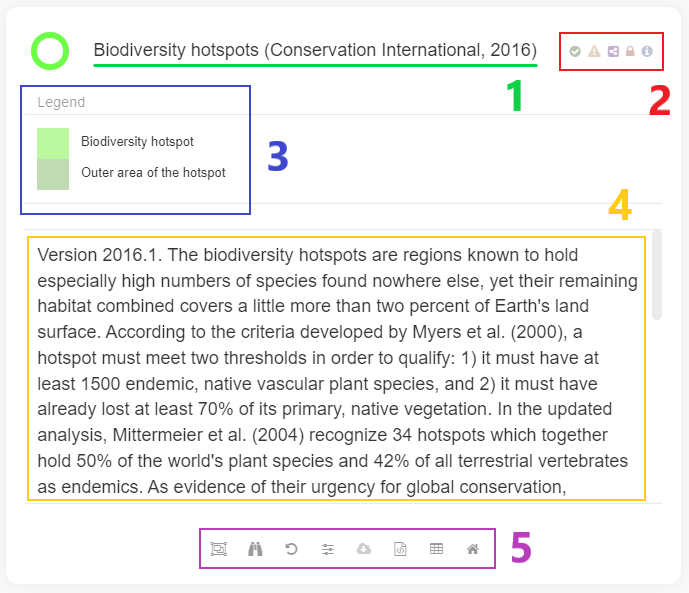

Views
=====

MapX uses a two-level data management system based on **sources** and
**views**.

A **source** is the underlying spatial dataset stored in the MapX database.
A **view** is the cartographic representation of a source, defining how the
data is displayed and interacted with on the map. In practice, however, views
can go beyond simple map rendering and may include custom interfaces, external
data connections, or communication-oriented layouts.

The main types of views available in MapX are:

Vector tile views
    Vector tile views are used to display spatial data published in the MapX
    database.

Raster views
    Raster views are based on external data services, as MapX does not store
    raster data directly in its database.

Custom coded views
    Custom coded views are fully customizable views that can be used to display
    data from external sources or implement advanced interactive features, such
    as drop-down lists, sliders, charts, or other custom controls. Creating
    this type of view requires advanced web development skills.

Story maps
    Story maps are communication products that combine spatial data with other
    types of content, such as text, images, charts, and videos.

Local GeoJSON views
    Local GeoJSON views allow users to visualize vector data without uploading
    it to the MapX database. The data is temporarily stored in the user's
    browser and is not persisted in the MapX database.

The different view types are identifiable in MapX by the color of the
circle displayed to the left of their title:

- green: vector
- purple: raster
- blue: story map
- red: custom code
- orange: local GeoJSON

   Types of view

In the MapX interface, a view is presented as follows in the data
catalog:

   Anatomy of a View

1. view title
2. badges associated with the view
3. legend of the style applied to the data
4. abstract providing users with key information to understand the data
5. tools associated with the view

To display the data associated with a view on the map, simply click the
button next to the view's title. Multiple views can be activated at the
same time. When this is the case, the order in which views are displayed
in the map is defined by the position of the views in the catalog. It is
possible to modify the order by grabbing the view with the pointer and
dragging it in the catalog to change its position.

.. toctree::
   :titlesonly:
   :glob:

   badges
   tools
   querying-filtering-data
   publication-new-view
   dashboard
   sharing-views-projects
   download-tool
   attribute-table
   code-share
