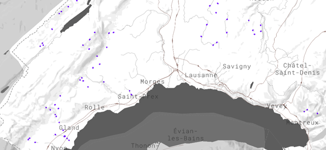
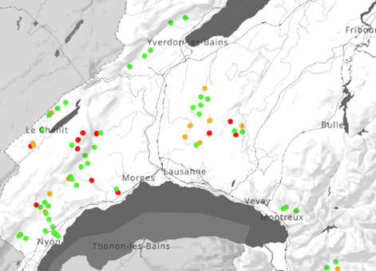
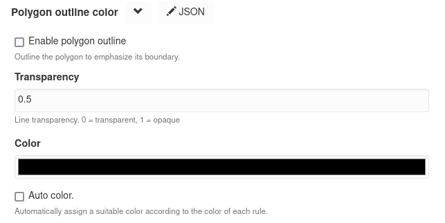
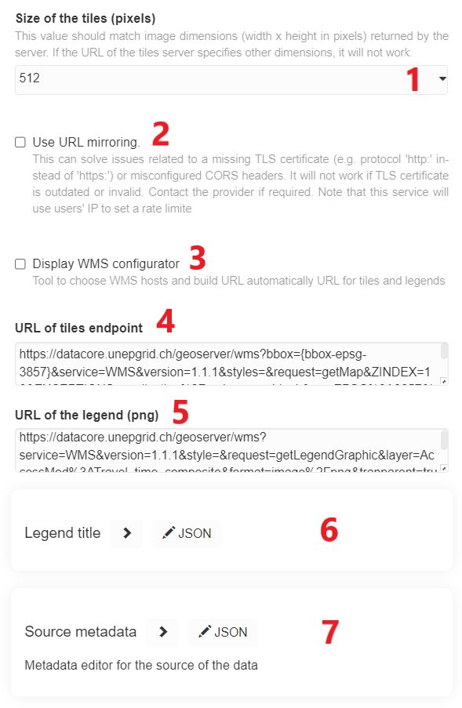
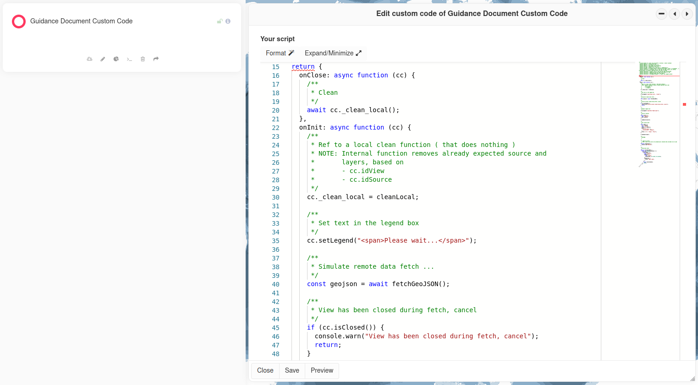

Publication of new views
========================

As described above, there are currently 4 types of views in MapX which
all have particularities in their publishing process. In this section,
the publishing process is described in detail for vector views and then
the specifics of raster and custom codes views will be discussed. Story
maps are covered in a dedicated
:doc:`chapter <../story-maps/creation-story-map>`.

Remember that publishing (and editing) views is limited to publishers
and administrators.

Vector views
------------

Creating a new view
~~~~~~~~~~~~~~~~~~~

1. To add a view, click on **Create a new view** from the **Toolbox**.
2. In the panel:

   1. Select the desired type of view (vector, raster (WMS/WMTS), story
      map or custom code) - select **Vector tiles** to create a new view
      based on a source stored in MapX database
   2. Define the view title
   3. Click on **Create** to validate. A message will confirm that
      everything went well.

      .. figure:: ./img/view-new-vt.png
         :width: 400
         :align: center
         :class: with-shadow

      .. figure:: ./img/view-new-vt-title.png
         :width: 400
         :align: center
         :class: with-shadow

3. The new view is now available in the left panel but it is empty.

   .. figure:: ./img/view-new-vt-panel.png
      :align: center
      :class: with-shadow

.. _configuring-view:

configuring a view
~~~~~~~~~~~~~~~~~~

1. To configure a vector view, click on it and then click on **Edit this
   view**:

   .. figure:: ./img/view-new-vt-edit-button.png
      :width: 200
      :align: center
      :class: with-shadow

2. A configuration panel appears, fill out the form and once it is done,
   click on **Save**.

   .. figure:: ./img/view-new-vt-edit-panel.png
      :width: 350
      :align: center
      :class: with-shadow

   1.  View title *[multilingual]*
   2.  Small description of your view (data, source, etc.)
       *[multilingual]*
   3.  Select other projects where the view will be visible. The view
       will not be editable from these projects.
   4.  Define who can access this view in MapX
   5.  Define who can edit this view in MapX
   6.  Select the source layer from the database
   7.  Type of geometry (cannot be changed)
   8.  Select the source attribute to display in the view
   9.  Select secondary attribute(s) to be displayed in the pop-up and
       in the attribute table, and/or used in the dashboard
   10. Get layer summary
   11. Add a mask to the view. This will produce an intersection between
       the two data sources (useful to observe overlapping features).

       .. figure:: ./img/view-new-vt-edit-panel-mask.png
          :width: 350
          :align: center
          :class: with-shadow

The view is now configured. The selected source variable is displayed on
the map when the view is activated but no style has been defined.

Creating a style
~~~~~~~~~~~~~~~~

1. To create a style for a vector view, click on **Set the style of this
   view**:

   .. figure:: ./img/view-new-vt-edit-style-button.png
      :width: 200
      :align: center
      :class: with-shadow

2. A configuration panel appears, fill out the form and once it is done,
   click on **Save**.

   .. figure:: ./img/view-new-vt-edit-style-panel.png
      :width: 450
      :align: center
      :class: with-shadow

   1. Missing values: rule allowing to style NA/null value.

   2. Rules to classify the data displayed in the map can be set
      manually:

      -  ``+`` Rule: add a class in the legend.
      -  Value: values defining the intervals of each class.
      -  Label: labels will be displayed in the view's legend in the
         left panel.
      -  Color, opacity & size: each class can be set independently of
         each other.
      -  Symbol: additional symbol can be added to each class feature.

   3. The **Auto style** tool automatically classifies data according to
      a **Number of bins** and **Binning method** (user-defined). Two
      visualization modes are available:

      1. **Colors**: a color ramp is selected by the user and from this,
         a color is assigned to each class automatically. In addition,
         it is possible to define a size (points and lines only) and an
         opacity which will be attributed to all classes.
      2. **Sizes**: a size is automatically calculated for each class
         between a start and end value defined by the user. In addition,
         it is possible to define a color and an opacity which will be
         attributed to all classes.

      A click on **Update rules** transfers all generated rules to the
      main **Edit style** panel.

      .. figure:: ./img/view-new-vt-edit-style-auto-style.png
         :align: center
         :class: with-shadow

      .. tip::
         Classification methods:

         -  **Equal interval** divides the range of values into equal-sized
            classes. MapX determines automatically where the breaks should be
            depending on the number of classes you specified. This type of
            classification is best used for continuous data such as precipitation
            or temperature.

         -  **Quantile** divides the range of values into classes containing an
            equal number of features. It is best used for data that is evenly
            distributed across its range.

         -  **Natural breaks (Jenks)** generates classes based on natural
            groupings inherent in the data. Breaks are calculated in a way that
            best groups similar values together and maximizes the differences
            between classes. It is best used for data that is unevenly
            distributed but not skewed toward either end of the distribution.

         -  **Head/tail breaks** is a classification scheme for grouping data
            with a heavy-tailed distribution that is characterized by a majority
            of small values in the tail and a minority of large values in the
            head (i.e., heavily right skewed). Heavy tailed distributions are
            commonly characterized by a power law, a lognormal or an exponential
            function.

         For more information and examples, see the sources on which 
         these explanations are based:

         -  `ArcGIS Pro
            Help <https://pro.arcgis.com/en/pro-app/latest/help/mapping/layer-properties/data-classification-methods.htm>`__
         -  `Essentials of Geographic Information Systems
            v1.0 <https://saylordotorg.github.io/text_essentials-of-geographic-information-systems/s10-03-data-classification.html>`__
            by Saylor Academy
         -  `Head/tail breaks <https://en.wikipedia.org/wiki/Head/tail_breaks>`__
            on Wikipedia

   4. Include upper bound in interval: if checked, the intervals will
      include the upper bound. Whatever option is selected, the minimum
      and maximum value are always included in the first and last
      intervals.

   5. Reverse displayed layers order: if checked, the layer stack will
      be reversed (the top rule will draw a layer at the bottom of the
      stack).

   6. Show symbol with label: if using symbols with point data, should
      MapX add labels around it?

   7. Zoom settings: option to vary the size of the points according to
      the zoom level.

   8. Custom style (advanced users - requires knowledge of Mapbox style
      specifications): creating a style by directly editing the view
      code. More information in Mapbox documentation.

   9. Legend title *[multilingual]*: title you want to give the legend.

Once the style is defined, it will be applied to the layer automatically
when it is consulted from the data catalog.

If the vector view contains polygon type features, an additional option
is present in the **Edit style** panel which allows to (de)activate and
configure an outline (applied to every rule defined in the style).

Raster views
------------

Unlike vector views which displays data published in the MapX database,
raster views can only display data from external sources. They support
Web Map Service (WMS) and Web Map Tile Service (WMTS) protocols from
platforms that comply with the Open GeoConsortium (OGC) Standards. Their
configuration differs a little from that of vector views:

-  the external data source and the source metadata are defined from the
   view's configuration panel.
-  the style of the layer and the legend are defined by the data
   provider and not in MapX.

After having created a new raster view, publishers can use the
additional fields in the configuration panel to set up the data source
and to fill the metadata.

1. Size of the tiles: this value should match image dimensions (width x
   height in pixels) returned by the server. If the URL of the tiles
   server specifies other dimensions, it will not work.
2. Use URL mirroring: as MapX requires an https connection with CORS
   enabled to fetch external content, this option can be activated to
   solve issues related to a missing TLS certificate (e.g., ``http``
   protocol instead of ``https``) or misconfigured CORS headers. It will
   not work if TLS certificate is outdated or invalid.
3. Display WMS configurator: this tool allows to automatically build
   tiles and legend URLs for a WMS endpoint. Publishers can choose from
   a drop-down list of predefined endpoints or manually enter a WMS
   endpoint to get the list of available layers. Once the layer to be
   published in MapX has been selected, a click on the **Update
   generated URL** button will automatically generate the queries to
   fetch the tiles and the legend from the service. As for WMTS, the
   **WMS configurator** does not support this type of service. Queries
   must be entered manually in the dedicated fields.

   .. figure:: ./img/view-new-rt-edit-wms-config.png
      :width: 400
      :align: center
      :class: with-shadow

4. URL of tiles endpoint: query to fetch the tiles (WMS/WMTS).
5. URL of the legend: query to fetch the legend. Please note that only
   the PNG format is supported.
6. Legend title *[multilingual]*: legend title to display in the view
   catalog.
7. Source metadata: since 2021, users can describe the view using the
   complete MapX metadata template (see 
   :doc:`Metadata <../metadata/structure-metadata>`)
   within the raster view configuration panel. A link to download
   the data source can be provided in the **Source** section of
   the metadata template.

Custom code views
-----------------

To have a larger spectrum of solutions when creating a view, MapX allows
developers (more details
:ref:`here <role-developer>`) to code a
view and thus customize it to their needs. Custom code views allow,
among other things, to publish external data (raster and/or vector), to
integrate advanced features such as sliders and/or drop-down lists or
even to interact with the map (e.g., zoom in on specific areas). The
development of this type of view is reserved for advanced users as it
requires knowledge of JavaScript, HTML, CSS and the Mapbox library.

As it is for raster views, users can describe the view using the
complete MapX metadata template (see
:doc:`Metadata <../metadata/structure-metadata>`) within the custom
code view configuration panel.

If you are interested in developing your own custom code views, please
contact the MapX team at: info@mapx.org.
