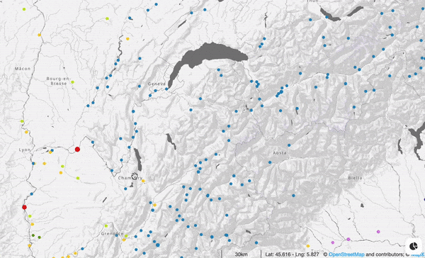
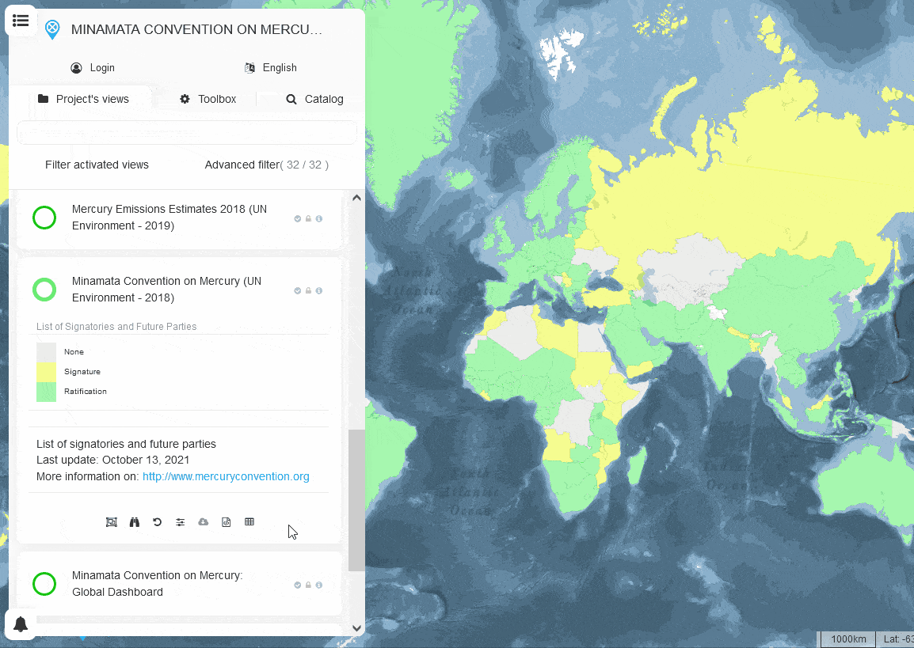
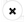

Querying and filtering data
===========================

When a feature is selected/clicked on the map, a pop-up showing its
attribute values is displayed (panel in the lower right corner).
The list of attributes is determined by the view creator in its settings
(i.e., secondary attributes). It is possible to filter the data displayed
on the map from this pop-up by clicking on any attribute values
(vector views only). By doing so, only features having the selected attribute
value will be displayed on the map. If several values are clicked, filters
will be combined with the logical operator ``OR`` meaning that all features
satisfying at least one filter/condition will be displayed on the map.
To return to the initial state of the view, several options are available:

- Close the pop-up by clicking on the |button| button (lower left corner)
- :doc:`Reset the view <tools>`
- Click on a location on the map which does not contain features

Data can also be filtered from the interactive legend of vector views by
clicking on any rules which will trigger a filter on the map.

.. figure:: ./img/view-panel-filter.gif
   :align: center
   :class: with-shadow

Other data filter tools (e.g., time-slider) are available to users from
the dedicated tool (see the above section).

