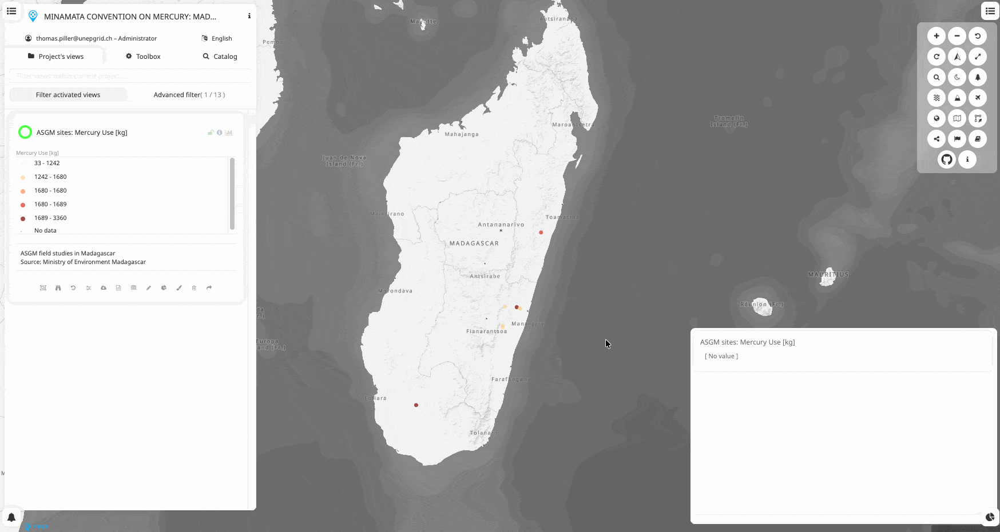
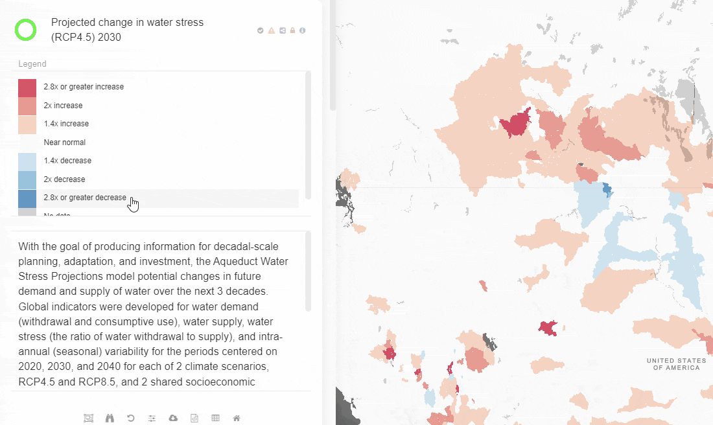
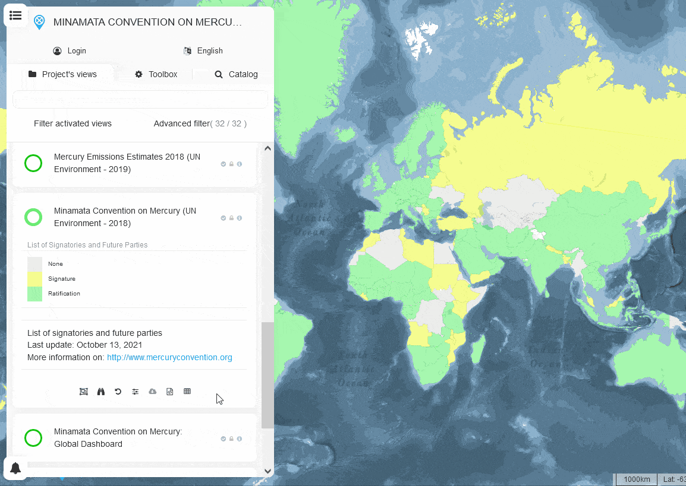
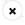

Querying and filtering data
===========================

When a feature is clicked on the map, a pop-up panel appears in the lower right
corner, displaying its attribute values in a table format. The list of
attributes shown is determined by the view creator's settings, specifically
secondary attributes. For vector views, you can filter one or more selected
features from the pop-up by clicking the checkboxes in the first column of
the table. Additionally, clicking on a value in the table highlights
all features sharing that value on the map. To reset the view to
its initial state, several options are available:

- :doc:`Reset the view <tools>`.
- Close the pop-up by clicking on the |button| button (lower left corner).
- Click on a location on the map which does not contain features.

Data can also be filtered from the interactive legend of vector views by
clicking on any rules which will trigger a filter on the map.

Other data filter tools (e.g., time-slider) are available to users from
the dedicated tool (see the above section).

