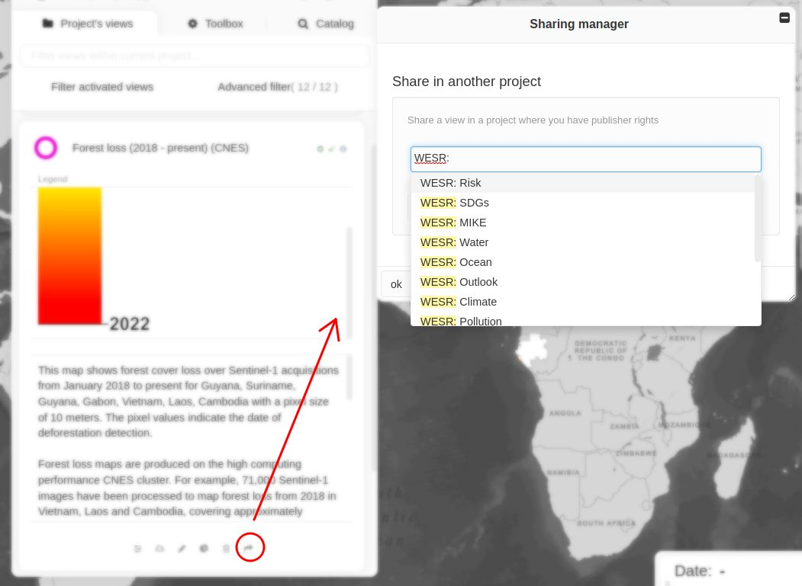

Sharing views between projects
==============================

All types of views can be shared to other projects. Shared views are
available without editing tools (i.e., view, style, dashboard) in
secondary projects. Sharing can be done from the view editing panel by
setting the name of the project(s) in which the view must be shared in
the field **Other projects where the view is visible**. The available
projects in which the view can be shared are those where the current
editor is at least publisher.

Views can also be imported into other projects by any user having
reading right on it using the **Share this view in another project**
tool (:doc:`link <tools>`). However, this action can be performed
only to projects in which the user is at least publisher. Views imported
into a project are listed and can be removed from the project by
publishers and administrators from the **Manage external views**
available in the **Toolbox**.

   Importing views
